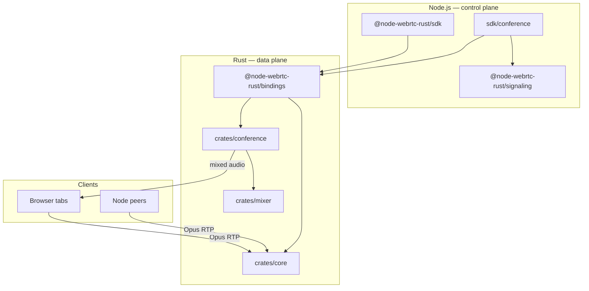

# node-webrtc-rust

[](https://github.com/akirilyuk/node-webrtc-rust/actions/workflows/build.yml)

**WebRTC for Node.js — native speed, browser-compatible APIs, Rust-side audio mixing.**

[node-webrtc-rust](https://github.com/akirilyuk/node-webrtc-rust) is an importable native module built with [NAPI-RS](https://napi.rs) and [webrtc-rs](https://github.com/webrtc-rs/webrtc). Use it like a browser `RTCPeerConnection` from TypeScript, or run multi-participant conference rooms where the Rust engine mixes microphone audio in real time.

Unlike standalone media servers (Mediasoup, LiveKit), there is **no separate infrastructure** to deploy — install an npm package, load a prebuilt `.node` binary, and go.

---

## Table of contents

- [Why node-webrtc-rust?](#why-node-webrtc-rust)
- [Features](#features)
- [Architecture](#architecture)
- [Packages](#packages)
- [Quick start — peer connection](#quick-start--peer-connection)
- [Quick start — conference room](#quick-start--conference-room)
- [Examples](#examples)
- [Supported platforms](#supported-platforms)
- [Development](#development)
- [Debug logging](#debug-logging)
- [Releases](#releases)
- [Roadmap](#roadmap)
- [License](#license)

---

## Why node-webrtc-rust?

| | node-webrtc-rust | Standalone SFU/MCU |
|---|---|---|
| **Deployment** | npm install | Separate server cluster |
| **API surface** | W3C-style `RTCPeerConnection` | Proprietary client SDK |
| **Audio mixing** | In-process Rust MCU | Remote media server |
| **Signaling** | Bring your own (helpers included) | Built into platform |
| **Best for** | Embedded WebRTC in Node apps | Large-scale hosted rooms |

The control plane lives in TypeScript (room admin, auth, signaling relay). The data plane — ICE, DTLS, RTP, Opus decode, PCM mixing, encode — runs entirely in Rust.

---

## Features

### WebRTC core (v0.1)

- Browser-compatible [`RTCPeerConnection`](packages/sdk/src/RTCPeerConnection.ts) API
- ICE with STUN and TURN
- SCTP DataChannels (text and binary)
- Local audio track send and remote track receive
- Optional WebSocket signaling server and client helpers
- Prebuilt native binaries for macOS, Linux, and Windows

### Conference audio (v0.2 preview)

- Rust-side MCU: one personalized mixed stream per listener
- **Exclude-self** mixing — you never hear your own mic in the mix
- Global mute, per-listener mute, and room-wide mixing on/off
- Participant kick and room lifecycle APIs
- Live waveform visualizer in browser demos

---

## Architecture



**Frame format:** 48 kHz stereo, 16-bit PCM, 20 ms frames (3 840 bytes) — matching Opus and `LocalAudioTrack.writeSample`.

---

## Packages

| Package | npm | Role |
| --- | --- | --- |
| [`@node-webrtc-rust/sdk`](packages/sdk) | TypeScript | W3C WebRTC API + [`/conference`](packages/sdk/README.md#conference-rooms) subpath for room mixing |
| [`@node-webrtc-rust/bindings`](packages/bindings) | Native | Single NAPI addon — peer connections, tracks, data channels, and conference rooms |
| [`@node-webrtc-rust/signaling`](packages/signaling) | TypeScript | WebSocket signaling server, client, auto-negotiate helper |

Platform-specific binding packages (`@node-webrtc-rust/bindings-darwin-arm64`, etc.) are published alongside the main packages.

---

## Quick start — peer connection

Install the SDK and signaling helpers:

```bash
npm install @node-webrtc-rust/sdk @node-webrtc-rust/signaling
```

Two peers over WebSocket signaling with a DataChannel:

```typescript
import { RTCPeerConnection } from '@node-webrtc-rust/sdk'
import { SignalingServer, SignalingClient, autoNegotiate } from '@node-webrtc-rust/signaling'

const server = new SignalingServer({ port: 8080 })
await server.listen()

// Peer 1 — impolite; creates the data channel
const pc1 = new RTCPeerConnection({
  iceServers: [{ urls: 'stun:stun.l.google.com:19302' }],
})
const sig1 = new SignalingClient({ url: 'ws://localhost:8080', room: 'demo' })
autoNegotiate({ pc: pc1, signaling: sig1, polite: false })
await sig1.connect()

const dc = pc1.createDataChannel('chat')
dc.onopen = () => dc.send('Hello from Peer 1!')

// Peer 2 — polite; receives the data channel
const pc2 = new RTCPeerConnection({
  iceServers: [{ urls: 'stun:stun.l.google.com:19302' }],
})
const sig2 = new SignalingClient({ url: 'ws://localhost:8080', room: 'demo' })
autoNegotiate({ pc: pc2, signaling: sig2, polite: true })
await sig2.connect()

pc2.ondatachannel = (event) => {
  event.channel.onmessage = (msg) => console.log('Received:', msg.data)
}
```

---

## Quick start — conference room

Install the SDK (conference APIs are included via the `/conference` subpath):

```bash
npm install @node-webrtc-rust/sdk @node-webrtc-rust/signaling
```

```typescript
import { createServer } from 'http'

import { ConferenceServer } from '@node-webrtc-rust/sdk/conference'
import { SignalingServer } from '@node-webrtc-rust/signaling'

const PORT = 8080
const httpServer = createServer()
const signaling = new SignalingServer({ server: httpServer, path: '/ws' })
await signaling.listen(PORT)

const conference = new ConferenceServer()
conference.attachSignaling({ url: `ws://127.0.0.1:${PORT}/ws` })

await conference.createRoom('demo', {
  maxParticipants: 16,
  iceServers: [{ urls: 'stun:stun.l.google.com:19302' }],
})

conference.on('participant-joined', ({ roomId, participantId }) => {
  console.log(`${participantId} joined ${roomId}`)
})
```

Each browser client sends mic audio; the Rust mixer returns a **personalized stream** (everyone else, never self). Conference mute modes and admin APIs are documented in [`packages/sdk/README.md`](packages/sdk/README.md) and [`packages/sdk/src/conference/`](packages/sdk/src/conference/).

---

## Examples

Runnable demos live under [`examples/`](examples/). From the repo root after `npm install`:

```bash
npm run build:ts
cd packages/bindings && npm run build:local
```

| Example | Command | What it shows |
| --- | --- | --- |
| **peer-connection** | `npm run start --workspace=@node-webrtc-rust/example-peer-connection` | Two Node peers, DataChannel over signaling |
| **audio-cosine** | `npm run start --workspace=@node-webrtc-rust/example-audio-cosine` | PCM cosine tone via `LocalAudioTrack` |
| **browser-cosine-chat** | `npm run start --workspace=@node-webrtc-rust/example-browser-cosine-chat` | Browser tabs hear a server tone + mesh chat; live waveform |
| **conference-room** | `npm run start --workspace=@node-webrtc-rust/example-conference-room` | Browser mic → Rust mixer → personalized audio; mute/kick UI |
| **conference-room-manual-signaling** | `npm run start --workspace=@node-webrtc-rust/example-conference-room-manual-signaling` | Same mixer; hand-rolled WebSocket signaling (no signaling package) |

**Conference demo:** open `http://localhost:8080` in multiple tabs, join the same room, allow microphone access. Waveform graphs show outgoing mic and incoming mixed track.

Details: [`examples/README.md`](examples/README.md)

---

## Supported platforms

Prebuilt `.node` binaries are published for:

| OS | Architecture | Triple |
| --- | --- | --- |
| macOS | Apple Silicon (M1+) | `aarch64-apple-darwin` |
| macOS | Intel | `x86_64-apple-darwin` |
| Linux | x64 glibc | `x86_64-unknown-linux-gnu` |
| Linux | x64 musl (Alpine) | `x86_64-unknown-linux-musl` |
| Linux | arm64 glibc | `aarch64-unknown-linux-gnu` |
| Windows | x64 MSVC | `x86_64-pc-windows-msvc` |

Node.js **≥ 18** required.

---

## Development

### Prerequisites

- [Rust](https://rustup.rs) (stable)
- Node.js ≥ 18, npm ≥ 9

### Clone and build

```bash
git clone https://github.com/akirilyuk/node-webrtc-rust.git
cd node-webrtc-rust
npm install

# Native addons — host only (fast local iteration)
cd packages/bindings && npm run build:debug:local

# TypeScript packages
cd ../.. && npm run build:ts
```

Use `build:local` (release) before running release-sensitive tests. Reserve `npm run build:all` inside bindings packages for CI / publish verification only.

### Tests

```bash
# Rust
cargo test -p node-webrtc-rust-core
cargo test -p node-webrtc-rust-mixer
cargo test -p node-webrtc-rust-conference

# TypeScript (unit + E2E)
npm test

# TURN integration (requires coturn)
docker compose -f docker-compose.test.yml up -d
TURN_AVAILABLE=1 npm test --workspace=@node-webrtc-rust/sdk
docker compose -f docker-compose.test.yml down
```

CI builds all platform targets using GitHub Actions. Linux builds and tests use a prebuilt container image (`ghcr.io/akirilyuk/node-webrtc-rust/ci-build:latest`) with Node, Rust, Zig, and CMake — rebuild it by pushing to the `ci` branch (see [`docker/ci/Dockerfile`](docker/ci/Dockerfile) and [`.github/workflows/ci-image.yml`](.github/workflows/ci-image.yml)). macOS and Windows jobs use native runners.

Before opening a PR, mirror CI locally to save Actions minutes:

```bash
npm run ci:verify:linux          # Linux napi cross-builds (Docker, same as CI)
npm run ci:verify:checks:docker  # format, lint, typecheck, cargo test, npm test
npm run ci:verify                # both
```

---

## Debug logging

Trace function calls and events across Rust core, NAPI bindings, SDK, signaling, and conference layers:

```bash
WEBRTC_DEBUG=1 node your-app.js
```

Accepted values: `1`, `true`, or `yes` (case-insensitive). Output uses the `[webrtc-debug]` prefix on stderr (Rust) and `console.error` (TypeScript):

```bash
WEBRTC_DEBUG=1 node your-app.js 2>&1 | grep '\[webrtc-debug\]'
```

Per-connection override:

```typescript
const pc = new RTCPeerConnection({
  iceServers: [{ urls: 'stun:stun.l.google.com:19302' }],
  debug: true,
})
```

When `debug` is set on the config object, it overrides the `WEBRTC_DEBUG` environment variable for that process.

---

## Releases

Full guide: [`scripts/RELEASE.md`](scripts/RELEASE.md)

### CI release (all platforms)

Merge to **`main`**, then push a **`release/*`** tag. GitHub Actions builds every target, runs tests, publishes to npm, and opens a GitHub Release.

```bash
git checkout main && git pull
git tag release/0.2.0
git push origin release/0.2.0
```

Tag examples: `release/0.2.0`, `release/0.2.0-beta.1`, `release/0.2.0-rc.1`. The part after `release/` is the npm version.

Requires repository secret **`NPM_TOKEN`**. Linux jobs use the CI image built from the **`ci`** branch (`ghcr.io/akirilyuk/node-webrtc-rust/ci-build:latest`).

### Local release

| Script | Use when |
| --- | --- |
| [`scripts/release-local.sh`](scripts/release-local.sh) | Publish from your machine for **one platform** (host `.node` only) |
| [`scripts/release-publish.sh`](scripts/release-publish.sh) | macOS: build Linux + Darwin locally; supply Windows `.node` separately |

```bash
# Host-only (fast)
./scripts/release-local.sh 0.2.0 "$NPM_TOKEN" --dry-run

# All platforms you can build on macOS (+ prebuilt Windows)
export NPM_TOKEN=...
npm run release:publish -- 0.2.0
```

After a local publish, commit version bumps and optionally push the same `release/x.y.z` tag for GitHub Release metadata.

---

## Roadmap

| Version | Focus |
| --- | --- |
| **v0.1.0** | PeerConnection, DataChannels, audio tracks, STUN/TURN, signaling helpers |
| **v0.2.0** | Conference audio mixing (MCU), mute matrix, browser demos |
| **v0.2.x** | Video tracks, video compositing |
| **v0.3.0** | Rust-side signaling server, statistics API, simulcast |

---

## License

MIT
