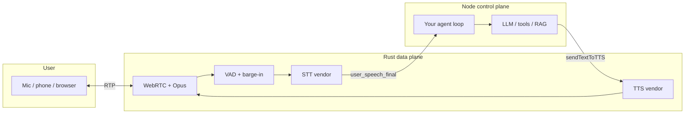
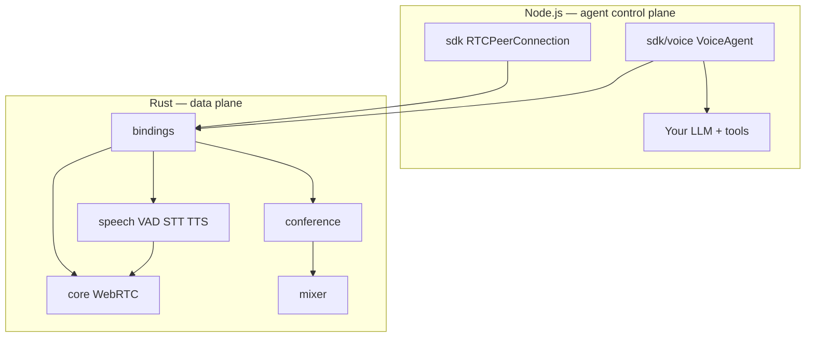

# node-webrtc-rust

[](https://github.com/akirilyuk/node-webrtc-rust/actions/workflows/build.yml)
[](https://www.npmjs.com/package/@node-webrtc-rust/sdk)

**Real-time voice agents in Node.js — WebRTC transport, Rust media timing, your LLM logic.**

[node-webrtc-rust](https://github.com/akirilyuk/node-webrtc-rust) is a native WebRTC stack for building **agentic voice workloads**: phone bots, browser voice assistants, and multi-tenant worker pods where Node runs business logic and Rust owns audio timing, VAD, barge-in, and TTS playback.

Install [`@node-webrtc-rust/sdk`](https://www.npmjs.com/package/@node-webrtc-rust/sdk) from npm, load a prebuilt `.node` binary, attach a `VoiceAgent` to a peer connection, and wire `user_speech_final` → your LLM → `sendTextToTTS()` — without reimplementing PCM frame cadence, Opus decode, or vendor HTTP/WebSocket clients in TypeScript.

Unlike standalone media servers (Mediasoup, LiveKit), there is **no separate SFU cluster** — WebRTC, mixing, and voice pipelines run **in-process** beside your agent code.

---

## Table of contents

- [Why build voice agents here?](#why-build-voice-agents-here)
- [Agentic voice quick start](#agentic-voice-quick-start)
- [Voice pipeline architecture](#voice-pipeline-architecture)
- [STT/TTS vendors and config](#stttts-vendors-and-config)
- [Speech events and barge-in](#speech-events-and-barge-in)
- [Examples and manual vendor testing](#examples-and-manual-vendor-testing)
- [WebRTC core and conference](#webrtc-core-and-conference)
- [Packages](#packages)
- [Supported platforms](#supported-platforms)
- [Development](#development)
- [Debug logging](#debug-logging)
- [Releases](#releases)
- [WebRTC API parity](#webrtc-api-parity)
- [Roadmap](#roadmap)
- [License](#license)

---

## Why build voice agents here?

Building a production voice agent means solving three problems at once:

| Problem          | Typical pain                              | node-webrtc-rust approach                                |
| ---------------- | ----------------------------------------- | -------------------------------------------------------- |
| **Transport**    | WebRTC ICE/SDP, Opus, jitter in Node      | Browser-compatible `RTCPeerConnection` + native Rust RTP |
| **Media timing** | TTS/STT frame alignment, barge-in latency | `VoiceAgent` in Rust: VAD, TTS buffer, atomic flush      |
| **Agent logic**  | LLM, tools, RAG, billing                  | Stay in **your** TypeScript — events up, text down       |



**What you implement in Node:** session config, LLM calls, tool use, persistence, auth.  
**What Rust handles:** inbound PCM loop, speech detection, vendor STT/TTS I/O, outbound PCM at 20 ms cadence, barge-in buffer flush before your callback runs.

One `VoiceAgent` binds to **one WebRTC conversation** (one inbound + one outbound track). Run **many agents in one Node process** via [`SessionPod`](packages/helpers/README.md#multi-session-pod-recommended-server-pattern) — one signaling entry point, one agent per connection, automatic cleanup on hangup.

**Try it:**

```bash
npm run start --workspace=@node-webrtc-rust/example-voice-agent-multi-session-pod
# Open http://localhost:3003 — use different session IDs in multiple tabs
```

See [`examples/voice-agent-multi-session-pod`](examples/voice-agent-multi-session-pod/README.md) and [`@node-webrtc-rust/helpers`](packages/helpers/README.md).

---

## Agentic voice quick start

Install the [SDK on npm](https://www.npmjs.com/package/@node-webrtc-rust/sdk) (voice APIs are on the `/voice` subpath):

```bash
npm install @node-webrtc-rust/sdk @node-webrtc-rust/signaling @node-webrtc-rust/helpers
```

Minimal **Pipeline B** loop — STT text events up, your LLM, TTS text down:

```typescript
import { LocalAudioTrack, RTCPeerConnection } from '@node-webrtc-rust/sdk'
import { VoiceAgent } from '@node-webrtc-rust/sdk/voice'

// After you have a connected PC and remote/local audio tracks from ontrack + addTrack:
const agent = new VoiceAgent({
  vad: {
    enabled: true,
    threshold: 0.5,
    bargeIn: { enabled: true, flushTts: true }, // native flush before barge_in event
  },
  stt: { provider: 'deepgram', model: 'nova-2', language: 'en' },
  tts: { provider: 'openai', model: 'tts-1', voice: 'alloy' },
  events: { mode: 'both' },
})

await agent.attach({
  inboundTrack: remoteUserTrack, // user speech → VAD/STT
  outboundTrack: agentLocalTrack, // TTS → remote hears agent
})
await agent.start()

// Callback style — familiar EventEmitter pattern
agent.on('user_speech_final', async (event) => {
  const reply = await myLLM(event.text!)
  for await (const chunk of reply) {
    await agent.sendTextToTTS(chunk) // streams to outbound track
  }
})

// Stream style — single async iterator for all speech events
void (async () => {
  for await (const event of agent.speechEvents()) {
    if (event.type === 'barge_in') await cancelLLMStream()
  }
})()
```

Use **`mock`** STT/TTS providers for local dev and CI (no API keys). See [Examples](#examples-and-manual-vendor-testing).

Full SDK reference: [`packages/sdk/README.md`](packages/sdk/README.md#voice-agent-build-agentic-workloads).

---

## Voice pipeline architecture

```
Inbound RTP (user) ──► RemoteAudioTrack.readSample()
                              │
                              ▼
                    ┌─────────────────────┐
                    │  VAD (energy/Silero) │──► user_speaking_start/end
                    │  barge-in flush      │──► barge_in
                    └──────────┬──────────┘
                               ▼
                    ┌─────────────────────┐
                    │  STT vendor adapter  │──► user_speech_partial/final
                    └─────────────────────┘

sendTextToTTS(text) ──► TTS vendor adapter ──► TtsPlaybackBuffer
                                                      │
                                                      ▼
                              LocalAudioTrack.writeSample() ──► Outbound RTP (agent)
```

| Layer         | Location                      | Role                                                             |
| ------------- | ----------------------------- | ---------------------------------------------------------------- |
| Orchestration | `crates/speech`               | Config, event bus, VAD, barge-in, TTS queue                      |
| Vendors       | `crates/vendor-*`             | OpenAI, Deepgram, ElevenLabs, Google, Cartesia, AssemblyAI, mock |
| Node API      | `@node-webrtc-rust/sdk/voice` | `VoiceAgent`, typed config, callbacks + `speechEvents()`         |
| Transport     | `@node-webrtc-rust/sdk`       | `RTCPeerConnection`, `LocalAudioTrack`, `RemoteAudioTrack`       |

**Frame format:** 48 kHz stereo, 16-bit PCM, 20 ms frames (3 840 bytes) on the WebRTC track path. VAD resamples to mono 16 kHz internally.

---

## STT/TTS vendors and config

STT and TTS providers are **independently configurable** — mix vendors per session:

| Provider           | STT | TTS | Env var(s)                                                              |
| ------------------ | --- | --- | ----------------------------------------------------------------------- |
| `openai`           | ✓   | ✓   | `OPENAI_API_KEY`                                                        |
| `deepgram`         | ✓   | —   | `DEEPGRAM_API_KEY`                                                      |
| `elevenlabs`       | —   | ✓   | `ELEVENLABS_API_KEY`                                                    |
| `cartesia`         | —   | ✓   | `CARTESIA_API_KEY`                                                      |
| `assemblyai`       | ✓   | —   | `ASSEMBLYAI_API_KEY`                                                    |
| `google`           | ✓   | ✓   | `GOOGLE_APPLICATION_CREDENTIALS`                                        |
| **`local-sherpa`** | ✓   | ✓   | `SHERPA_STT_MODEL_PATH`, `SHERPA_TTS_MODEL_PATH`, `SHERPA_STT_LANGUAGE` |
| `mock`             | ✓   | ✓   | _(none — CI/local)_                                                     |

Pass `apiKey` in config or rely on env vars. Keys are never logged or returned in events.

### Free local STT (`local-sherpa`)

For production voice agents that handle **sensitive audio** or need **lower STT latency**, prefer **`local-sherpa`**: Sherpa-ONNX runs on your worker CPU, so user speech is **not** sent to third-party STT APIs and you skip cloud STT network round-trips. Models are free to download; no STT API key required.

```bash
npm run download-stt --workspace=@node-webrtc-rust/example-voice-agent-local-sherpa
npm run download-tts --workspace=@node-webrtc-rust/example-voice-agent-local-sherpa
export SHERPA_STT_MODEL_PATH="$PWD/examples/voice-agent-local-sherpa/.models/sherpa-onnx-streaming-zipformer-en-kroko-2025-08-06"
export SHERPA_TTS_MODEL_PATH="$PWD/examples/voice-agent-local-sherpa/.models/vits-piper-en_US-amy-low"
npm run start --workspace=@node-webrtc-rust/example-voice-agent-local-sherpa
```

Multilingual bundles and per-language scripts: [`examples/voice-agent-local-sherpa/README.md`](examples/voice-agent-local-sherpa/README.md). Cloud STT vendors in the table above remain available when you need vendor-specific models or locales without a local bundle.

Live HTTP/WebSocket calls live in Rust `vendor-*` crates (SDK-first). Default CI builds use stub adapters; enable per-crate `live` features when wiring production vendor calls.

---

## Speech events and barge-in

| Event                          | Source       | When to use in your agent                                                 |
| ------------------------------ | ------------ | ------------------------------------------------------------------------- |
| `user_speaking_start`          | VAD          | Fast interrupt signal; pairs with barge-in                                |
| `user_speaking_end`            | VAD + hold   | End-of-utterance hint (`gateStt`: after `sttGateHoldMs`, not first pause) |
| `user_speech_partial`          | STT          | Live captions, early LLM prefetch                                         |
| `user_speech_final`            | STT          | **Primary turn trigger** for LLM                                          |
| `agent_speaking_start` / `end` | TTS playback | UI/state machine                                                          |
| `barge_in`                     | VAD + config | User interrupted agent — cancel LLM/TTS                                   |
| `error`                        | Any          | Vendor or pipeline failure                                                |

**Barge-in** is two independent toggles under `vad.bargeIn`:

| `enabled` | `flushTts`       | Behavior                                                             |
| --------- | ---------------- | -------------------------------------------------------------------- |
| `true`    | `true` (default) | Native TTS buffer flush **first**, then `barge_in` event             |
| `true`    | `false`          | Emit `barge_in` only — TTS keeps playing until you call `flushTts()` |
| `false`   | \*               | No barge-in event, no native flush                                   |

**Delivery:** `events.mode` = `callback` | `stream` | `both` (handlers + `speechEvents()` async iterator).

---

## Examples and manual vendor testing

```bash
npm run setup   # once: deps + native .node + TS build
```

| Example                           | Command                                                                             | Teaches                                                                             |
| --------------------------------- | ----------------------------------------------------------------------------------- | ----------------------------------------------------------------------------------- |
| **voice-agent-local-sherpa**      | `download-stt` + `download-tts` + `start:roundtrip`                                 | **Free on-device STT + TTS**; Node roundtrip or browser mic → Sherpa                |
| **voice-agent-browser**           | `npm run start --workspace=@node-webrtc-rust/example-voice-agent-browser`           | Browser mic → STT events; client triggers TTS + barge-in                            |
| **voice-agent-multi-session-pod** | `npm run start --workspace=@node-webrtc-rust/example-voice-agent-multi-session-pod` | **Many concurrent sessions on one server** — `SessionPod`, one agent per connection |
| **voice-agent** callback          | `npm run start:callback --workspace=@node-webrtc-rust/example-voice-agent`          | `agent.on()` handlers, mock vendors                                                 |
| **voice-agent** stream            | `npm run start:stream --workspace=...`                                              | `for await … speechEvents()`                                                        |
| **voice-agent** barge-in          | `npm run start:barge-in --workspace=...`                                            | VAD + `flushTts`                                                                    |
| **voice-agent** live OpenAI       | `OPENAI_API_KEY=sk-... npm run start:live:openai --workspace=...`                   | Real vendor config + loopback                                                       |
| **voice-agent** live \*           | `start:live:deepgram` / `elevenlabs` / `cartesia` / `assemblyai` / `google`         | Per-vendor credentials                                                              |

Inline comments in [`examples/voice-agent/`](examples/voice-agent/) explain track directions (`agentInbound` vs `agentOut`), event modes, and vendor pairing. See [`examples/voice-agent/README.md`](examples/voice-agent/README.md).

SDK live tests (opt-in):

```bash
VOICE_LIVE_TEST=1 VOICE_LIVE_OPENAI=1 OPENAI_API_KEY=sk-... \
  npm run test --workspace=@node-webrtc-rust/sdk -- voice-live
```

Other WebRTC demos (peer connection, conference MCU): [`examples/README.md`](examples/README.md).

---

## WebRTC core and conference

### Why node-webrtc-rust vs standalone SFU?

|                       | node-webrtc-rust                         | Standalone SFU/MCU            |
| --------------------- | ---------------------------------------- | ----------------------------- |
| **Deployment**        | npm install                              | Separate server cluster       |
| **Voice agents**      | In-process `VoiceAgent` + your Node loop | Custom bridge to media server |
| **API surface**       | W3C-style `RTCPeerConnection`            | Proprietary client SDK        |
| **Conference mixing** | In-process Rust MCU                      | Remote media server           |
| **Best for**          | Embedded agents, session workers         | Large hosted rooms            |

### Quick start — peer connection

```bash
npm install @node-webrtc-rust/sdk @node-webrtc-rust/signaling @node-webrtc-rust/helpers
```

```typescript
import { RTCPeerConnection } from '@node-webrtc-rust/sdk'
import { SignalingServer, SignalingClient, autoNegotiate } from '@node-webrtc-rust/signaling'

const server = new SignalingServer({ port: 8080 })
await server.listen()

const pc1 = new RTCPeerConnection({
  iceServers: [{ urls: 'stun:stun.l.google.com:19302' }],
})
const sig1 = new SignalingClient({ url: 'ws://localhost:8080', room: 'demo' })
autoNegotiate({ pc: pc1, signaling: sig1, polite: false })
await sig1.connect()

const dc = pc1.createDataChannel('chat')
dc.onopen = () => dc.send('Hello from Peer 1!')
```

### Quick start — conference room

Multi-participant MCU with personalized mixes (everyone else, never self):

```typescript
import { ConferenceServer } from '@node-webrtc-rust/sdk/conference'
import { SignalingServer } from '@node-webrtc-rust/signaling'

const conference = new ConferenceServer()
conference.attachSignaling({ url: 'ws://127.0.0.1:8080/ws' })
await conference.createRoom('demo', {
  maxParticipants: 16,
  iceServers: [{ urls: 'stun:stun.l.google.com:19302' }],
})
```

See [`packages/sdk/README.md`](packages/sdk/README.md) for conference mute modes and events.

### Features (summary)

- **WebRTC core:** ICE, DTLS, DataChannels, Unified Plan transceivers, `RemoteAudioTrack.readSample()`
- **Conference (v0.2):** Rust MCU, exclude-self mixing, mute matrix, kick/admin APIs

---

## Architecture



---

## Packages

| Package                                                                                              | npm        | Role                                                                                                                                           |
| ---------------------------------------------------------------------------------------------------- | ---------- | ---------------------------------------------------------------------------------------------------------------------------------------------- |
| [`@node-webrtc-rust/sdk`](packages/sdk) · [npm](https://www.npmjs.com/package/@node-webrtc-rust/sdk) | TypeScript | WebRTC API + [`/voice`](packages/sdk/README.md#voice-agent-build-agentic-workloads) + [`/conference`](packages/sdk/README.md#conference-rooms) |
| [`@node-webrtc-rust/bindings`](packages/bindings)                                                    | Native     | NAPI addon — peer connections, tracks, VoiceAgent, conference                                                                                  |
| [`@node-webrtc-rust/signaling`](packages/signaling)                                                  | TypeScript | WebSocket signaling server, client, auto-negotiate                                                                                             |
| [`@node-webrtc-rust/helpers`](packages/helpers)                                                      | TypeScript | [`SessionPod`](packages/helpers/README.md), `VoiceAgentSessionHost`, PCM kick-frame helpers                                                    |

Platform-specific binding packages (`@node-webrtc-rust/bindings-darwin-arm64`, etc.) ship with releases.

---

## Supported platforms

Prebuilt `.node` binaries are published for:

| OS      | Architecture        | Triple                      |
| ------- | ------------------- | --------------------------- |
| macOS   | Apple Silicon (M1+) | `aarch64-apple-darwin`      |
| macOS   | Intel               | `x86_64-apple-darwin`       |
| Linux   | x64 glibc           | `x86_64-unknown-linux-gnu`  |
| Linux   | x64 musl (Alpine)   | `x86_64-unknown-linux-musl` |
| Linux   | arm64 glibc         | `aarch64-unknown-linux-gnu` |
| Windows | x64 MSVC            | `x86_64-pc-windows-msvc`    |

Node.js **≥ 18** required.

---

## Development

### Prerequisites

- [Rust](https://rustup.rs) (stable)
- Node.js ≥ 18, npm ≥ 9

### Clone and build

```bash
git clone https://github.com/akirilyuk/node-webrtc-rust.git
cd node-webrtc-rust
npm run setup   # install deps, build native .node, build TS packages
```

Or step by step:

```bash
npm run install:all
npm run build:native   # host-only debug .node (~10s after cache warm)
npm run build:ts
```

Use release builds (`cd packages/bindings && npm run build:local`) before release-sensitive tests. Reserve `npm run build:all` in bindings for CI / publish verification only.

### Dev scripts (examples)

| Script | Purpose |
| ------ | ------- |
| [`scripts/free-port.sh`](scripts/free-port.sh) | Kill listeners on a port before `npm run start` (multi-client uses npm `prestart`) |
| [`scripts/export-sherpa-local-models.sh`](scripts/export-sherpa-local-models.sh) | Set `SHERPA_*` paths for local Sherpa examples |

Details: [`scripts/README.md`](scripts/README.md).

### Tests

```bash
# Everything: Rust workspace + npm workspaces (sdk, signaling)
npm run test:all

# Rust only
npm run test:rust

# TypeScript / Vitest only (sdk, signaling)
npm run test:ts
```

`test:all` runs `cargo test --workspace` (core, mixer, conference, bindings compile) and `npm test` in every workspace that defines a test script. Requires a built `.node` — use `npm run build:native` first if needed.

TURN integration (optional, skipped by default):

```bash
docker compose -f docker-compose.test.yml up -d
TURN_AVAILABLE=1 npm test --workspace=@node-webrtc-rust/sdk
docker compose -f docker-compose.test.yml down
```

CI builds all platform targets using GitHub Actions. See **[`scripts/ci/README.md`](scripts/ci/README.md)** for pipeline diagrams, path filters, and caching.

Linux builds and tests use a prebuilt container image (`ghcr.io/akirilyuk/node-webrtc-rust/ci-build:latest`) with Node, Rust, Zig, and CMake — rebuild it by pushing to the `ci` branch (see [`docker/ci/Dockerfile`](docker/ci/Dockerfile) and [`.github/workflows/ci-image.yml`](.github/workflows/ci-image.yml)). macOS and Windows jobs use native runners.

Before opening a PR, mirror CI locally to save Actions minutes:

```bash
npm run build:native             # host .node for npm test
npm run ci:verify:checks         # format, lint, typecheck, cargo test, npm test, Sherpa E2E
npm run ci:verify                # alias for ci:verify:checks
npm run ci:verify:linux          # optional: Linux napi cross-builds in Docker
```

---

## Debug logging

Trace function calls and events across Rust core, NAPI bindings, SDK, signaling, and conference layers:

```bash
WEBRTC_DEBUG=1 node your-app.js
```

Accepted values: `1`, `true`, or `yes` (case-insensitive). Output uses the `[webrtc-debug]` prefix on stderr (Rust) and `console.error` (TypeScript):

```bash
WEBRTC_DEBUG=1 node your-app.js 2>&1 | grep '\[webrtc-debug\]'
```

Per-connection override:

```typescript
const pc = new RTCPeerConnection({
  iceServers: [{ urls: 'stun:stun.l.google.com:19302' }],
  debug: true,
})
```

When `debug` is set on the config object, it overrides the `WEBRTC_DEBUG` environment variable for that process.

---

## Releases

Full guide: [`scripts/RELEASE.md`](scripts/RELEASE.md)  
Changelog: [`CHANGELOG.md`](CHANGELOG.md)

### CI release (all platforms)

1. Open a prep PR from **`release-prep/X.Y.Z`** → **`main`** (CHANGELOG + `SKIP_LOCK_REFRESH=1` version bump). See [`scripts/RELEASE.md`](scripts/RELEASE.md).
2. After merge, tag **`main`** and push the tag (`refs/tags/release/X.Y.Z`). CI builds all targets, tests, publishes to npm, and opens a GitHub Release.
3. **Merge the bot PR** `chore/post-release-package-lock-X.Y.Z` so `package-lock.json` matches npm (required for `npm ci` on `main`).

```bash
# After release prep is merged:
git checkout main && git pull
git tag release/0.2.0
git push origin refs/tags/release/0.2.0
# Then merge the automated package-lock sync PR when the workflow finishes
```

**Tags** (publish trigger): `release/0.2.0`, `release/0.2.0-beta.1`, `release/0.2.0-rc.1` — the part after `release/` is the npm version.

**Prep branches** (ephemeral): `release-prep/0.2.0` — delete after the prep PR merges; do not reuse the tag name as a branch.

Requires **`NPM_TOKEN`**. Linux jobs use the CI image from the **`ci`** branch (`ghcr.io/akirilyuk/node-webrtc-rust/ci-build:latest`).

Lockfile validation runs on every PR and `main` (`npm run ci:validate:package-lock`). Details: [Package-lock.json after release](scripts/RELEASE.md#package-lockjson-after-release).

### Local release

| Script                                                     | Use when                                                               |
| ---------------------------------------------------------- | ---------------------------------------------------------------------- |
| [`scripts/release-local.sh`](scripts/release-local.sh)     | Publish from your machine for **one platform** (host `.node` only)     |
| [`scripts/release-publish.sh`](scripts/release-publish.sh) | macOS: build Linux + Darwin locally; supply Windows `.node` separately |

```bash
# Host-only (fast)
./scripts/release-local.sh 0.2.0 "$NPM_TOKEN" --dry-run

# All platforms you can build on macOS (+ prebuilt Windows)
export NPM_TOKEN=...
npm run release:publish -- 0.2.0
```

After a local publish, run `bash scripts/ci/post-release-sync-main-package-lock.sh <version>`, commit, and push the `release/x.y.z` tag (CI will also open a package-lock PR on `main` if you use the tag workflow).

---

## WebRTC API parity

The SDK mirrors browser **WebRTC 1.0** where it matters for Node↔browser audio and data channels. Full gap analysis (supported / partial / missing) lives in **[`docs/webrtc-api-parity.md`](docs/webrtc-api-parity.md)** — update that doc when adding or changing public APIs.

High-level: ICE/SDP, data channels, P0–P1 parity, and Unified Plan transceivers are in place for Node↔browser audio. **Video**, **simulcast**, **DTMF**, and deeper browser alignment are on the [outlook roadmap](ROADMAP.md#w3c-webrtc-parity).

---

## Roadmap

Planned work (no version targets) lives in **[`ROADMAP.md`](ROADMAP.md)**. Summary:

| Area | Direction |
| ---- | --------- |
| **Observability** | OpenTelemetry metrics with Rust + Node configuration; separate OTel verbosity levels; scoped logs (WebRTC, voice, conference, …) instead of one global debug flag |
| **WebRTC** | More [W3C WebRTC parity](docs/webrtc-api-parity.md) (video, simulcast, DTMF, remaining P2 gaps) |
| **Conference** | Video mixing / MCU-style compositing alongside audio `MixGraph` |
| **Integrations** | Discord voice channel connectivity |

---

## License

MIT
