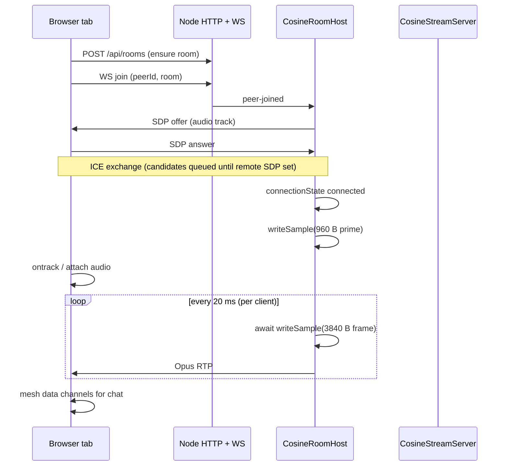

# Browser Cosine + Chat

Node server streams a 440 Hz cosine tone to browser tabs; clients in the same
room chat over peer-to-peer WebRTC data channels.

```bash
npm run start --workspace=@node-webrtc-rust/example-browser-cosine-chat
```

Open **http://localhost:3000** in multiple tabs, enter the same room name, and
click **Connect**.

---

## Architecture



Each browser tab has **two** peer connections:

| Connection                | Purpose                                 |
| ------------------------- | --------------------------------------- |
| Browser ↔ `cosine-server` | Server-pushed 440 Hz tone (audio track) |
| Browser ↔ Browser         | Room chat (data channel, mesh)          |

---

## Audio streaming lifecycle (critical)

This is the most important integration detail when sending audio **from Node**
to any receiver (Node SDK or native browser).

### Rule: SDP is not enough

`RTCPeerConnection.addTrack` + offer/answer negotiates codecs and directions,
but **no media flows until `writeSample` is called** on the sender after ICE
connects. Receivers will not get a usable track without it.

### Step-by-step (server → browser)

Implementation: `src/cosine-room-host.ts` (one async loop per browser client).

| Step | When              | Action                                                          |
| ---- | ----------------- | --------------------------------------------------------------- |
| 1    | Client joins room | Create `LocalAudioTrack`, `addTrack`, send offer                |
| 2    | Answer + ICE      | Queue remote ICE until `setRemoteDescription(answer)` completes |
| 3    | `connected`       | **Prime:** `writeSample(960 B, 5 ms)` — kicks browser ontrack   |
| 4    | Loop every 20 ms  | **Stream:** `writeSample(3840 B, 20 ms)` — await each call      |

Shared constants and rationale: [`examples/shared/pcm-streaming.ts`](../shared/pcm-streaming.ts).

### Why 960 B @ 5 ms?

RTP timestamp advance comes from `durationMs`, not byte length.

| Kick                                 | Browser ontrack      | Continuous tone                               |
| ------------------------------------ | -------------------- | --------------------------------------------- |
| 960 B @ 20 ms (default)              | Yes                  | **No** — RTP timeline breaks after first blip |
| 3840 B @ 20 ms only                  | **No** in this stack | N/A                                           |
| **960 B @ 5 ms** then 3840 B @ 20 ms | Yes                  | **Yes**                                       |

### Browser receiver (`public/client.js`)

Native browser `ontrack` may fire at SDP time for some peers, but when receiving
from this Node sender it typically needs the first RTP packet (the prime).

The client handles both paths:

1. **`pc.ontrack`** — attach `MediaStream` to `<audio>` when the event fires.
2. **`onconnectionstatechange` fallback** — if `ontrack` has not fired by
   `connected`, scan `getReceivers()` for an audio track and attach it.

### Node SDK receiver

Same prime requirement. See `examples/audio-cosine` and
`packages/sdk/tests/e2e.test.ts`:

```typescript
await waitForConnection(sender)
await waitForConnection(receiver)
await toneTrack.writeSample(Buffer.alloc(960)) // prime — ontrack fires here
streamServer.start() // then continuous 3840 B frames
```

---

## Signaling and ICE

- WebSocket signaling on `/ws` (same port as HTTP, default **3000**).
- Server peer id: `cosine-server`; browser clients: `client-*`.
- **ICE candidates are queued** on both sides until the remote SDP is applied
  (prevents "remote description is not set" crashes during trickle ICE).

## Chat display names

Mesh chat uses data channels. On channel open each peer sends
`{ type: 'hello', name: displayName }` so system messages show display names
instead of `client-*` ids.

---

## Troubleshooting

| Problem                             | Check                                                                                                            |
| ----------------------------------- | ---------------------------------------------------------------------------------------------------------------- |
| "Waiting for server track…" forever | Server logs for `Streaming … Hz tone to client-*`; prime frame after `connected`; browser console for ICE errors |
| One blip then silence               | Streaming loop must **await** each `writeSample` — see `CosineStreamServer.runTick`                              |
| Server crash on join                | ICE applied before answer — see `pendingIce` in `cosine-room-host.ts`                                            |
| Chat shows client ids               | Hello handshake not received — open two tabs, same room, both connected                                          |
| No audio, track attached            | Browser autoplay — click Connect (user gesture); check `<audio autoplay playsinline>`                            |

Debug logging:

```bash
WEBRTC_DEBUG=1 npm run start --workspace=@node-webrtc-rust/example-browser-cosine-chat
```
