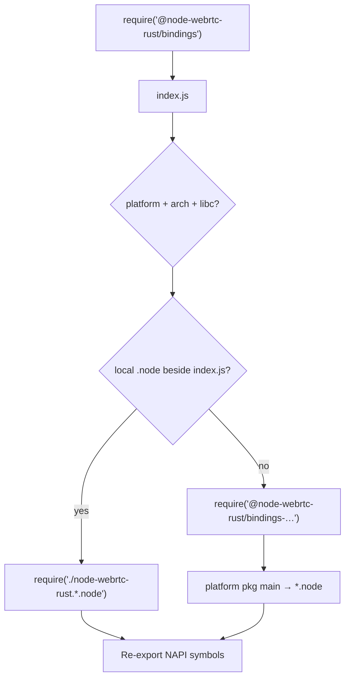

# @node-webrtc-rust/bindings

Native NAPI-RS bindings for node-webrtc-rust. This package provides the compiled `.node` addon that bridges Rust and Node.js — including W3C WebRTC APIs and conference room mixing.

## For end users

Just install the package — prebuilt binaries are resolved automatically via `optionalDependencies`:

```bash
npm install @node-webrtc-rust/bindings
```

No Rust toolchain required. The correct platform-specific binary is downloaded during install.

### Supported platforms

| OS      | Arch              | Package                                      |
| ------- | ----------------- | -------------------------------------------- |
| macOS   | arm64 (M1+)       | `@node-webrtc-rust/bindings-darwin-arm64`    |
| macOS   | x64 (Intel)       | `@node-webrtc-rust/bindings-darwin-x64`      |
| Linux   | x64 (glibc)       | `@node-webrtc-rust/bindings-linux-x64-gnu`   |
| Linux   | x64 (musl/Alpine) | `@node-webrtc-rust/bindings-linux-x64-musl`  |
| Linux   | arm64 (glibc)     | `@node-webrtc-rust/bindings-linux-arm64-gnu` |
| Windows | x64 (MSVC)        | `@node-webrtc-rust/bindings-win32-x64-msvc`  |

## For developers (building from source)

Prerequisites:

- Rust toolchain (stable, via [rustup](https://rustup.rs))
- Node.js >= 18
- `@napi-rs/cli` (installed as devDependency)

```bash
cd packages/bindings
npm install
npm run build:local        # release build for current platform (default)
npm run build:debug:local  # debug build — fastest iteration loop
```

For all platform targets (CI/publish only):

```bash
npm run build:all
```

This produces a `node-webrtc-rust.<platform>.node` file in the current directory, which the loader (`index.js`) picks up as a fallback when no platform package is installed.

### Debug logging

Set `WEBRTC_DEBUG=1` (or pass `debug: true` in `JsRTCConfiguration`) to emit `[webrtc-debug]` lines from native bindings and the Rust core. See the root README for details.

## How native loading works

The root `@node-webrtc-rust/bindings` package ships **no binary** — only `index.js`, `index.d.ts`, and loader logic. The compiled addon lives in separate platform packages listed as **`optionalDependencies`**.

### At `npm install`

The matching platform package is **installed during `npm install`**, not downloaded when your app first runs. Runtime `require()` only loads what is already in `node_modules`.

When you install `@node-webrtc-rust/bindings`, npm:

1. Installs the root package (loader only — no `.node`).
2. **Attempts each `optionalDependency`** (e.g. `bindings-darwin-arm64`, `bindings-linux-x64-gnu`, …).
3. Keeps only packages whose `"os"` / `"cpu"` fields match your machine; others are skipped.
4. Does **not** fail the install if a non-matching or unavailable optional package is skipped — that is what “optional” means.

On macOS arm64 you typically get:

```text
node_modules/@node-webrtc-rust/bindings/          ← loader (index.js)
node_modules/@node-webrtc-rust/bindings-darwin-arm64/
  node-webrtc-rust.darwin-arm64.node              ← actual native addon
```

Each platform package is a thin wrapper: its `"main"` field points directly at the `.node` file, so `require('@node-webrtc-rust/bindings-darwin-arm64')` loads the native module.

**When the binary might be missing after install:**

| Situation | Result |
| --- | --- |
| Normal install on a supported platform | Matching optional package is present |
| `npm install --omit=optional` | No platform package — runtime fails unless a local `.node` exists |
| Unsupported OS/arch | No matching optional package |
| Publish/version mismatch for the optional pkg | Install may succeed; `require()` fails at runtime |

### At runtime (`require('@node-webrtc-rust/bindings')`)

`index.js` (auto-generated by NAPI-RS) picks the binary for the current process:

1. **Detect platform** — `process.platform`, `process.arch`, and on Linux whether the libc is musl or glibc (`isMusl()`).
2. **Local dev fallback** — if `node-webrtc-rust.<platform>.node` sits next to `index.js` (from `npm run build:local`), `require` that file directly.
3. **Published path** — otherwise `require` the matching optional package (e.g. `@node-webrtc-rust/bindings-linux-x64-gnu`).
4. **Re-export** — bind NAPI exports (`JsPeerConnection`, `JsConferenceRoom`, …) onto `module.exports`.

If both paths fail, Node throws with the underlying `loadError`.



### TypeScript note

This package is the **only** Node-facing package that ships hand-written JavaScript (`index.js`) for the napi-rs prebuild loader. The loader re-exports the full native module (WebRTC peer APIs and conference room APIs). TypeScript consumers use the generated `index.d.ts`. Higher-level APIs live in `@node-webrtc-rust/sdk` (including `@node-webrtc-rust/sdk/conference`) and `@node-webrtc-rust/signaling`.

## Cross-compilation

CI builds all platform targets using GitHub Actions. Linux builds and tests pull `ghcr.io/akirilyuk/node-webrtc-rust/ci-build:latest` (rebuild by pushing to the `ci` branch — see [`docker/ci/Dockerfile`](../../docker/ci/Dockerfile) and [`.github/workflows/ci-image.yml`](../../.github/workflows/ci-image.yml)). macOS and Windows jobs use native runners. See [`.github/workflows/build.yml`](../../.github/workflows/build.yml).
