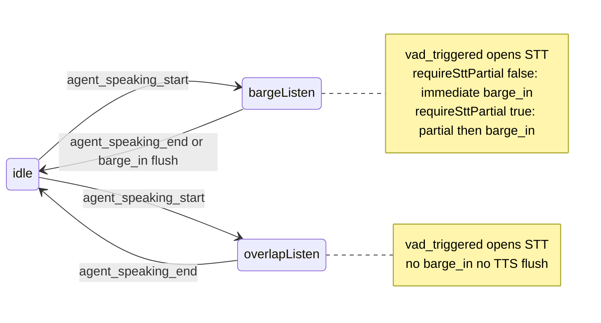

# VAD and barge-in guide

How `VoiceAgent` uses voice activity detection (VAD) and barge-in, which settings matter, and what you can leave at defaults.

Rust defaults live in `crates/speech/src/config.rs`. TypeScript mirrors them in [`src/voice/defaults.ts`](./src/voice/defaults.ts).

**API reference (exports, events, Rust modules):** [VOICE-API.md](./VOICE-API.md).

## Philosophy: defaults first

Most phone-bot / voice-assistant apps only need:

```typescript
import { VOICE_AGENT_VAD_PRESET } from '@node-webrtc-rust/sdk/voice'

const agent = new VoiceAgent({
  stt: { provider: 'deepgram' /* … */ },
  tts: { provider: 'openai' /* … */ },
  vad: VOICE_AGENT_VAD_PRESET,
  events: { mode: 'both' },
})
```

Or omit `vad` entirely and get library defaults (VAD on, barge-in on, `gateStt` off). For production voice agents that stream STT, prefer **`VOICE_AGENT_VAD_PRESET`** (`gateStt: true`).

Override a field only when you hit a concrete issue (false barge-in, STT cutting off words, TTS split into two utterances).

---

## Defaults at a glance

| Field                              | Default  | Role                                                                                                                                                        |
| ---------------------------------- | -------- | ----------------------------------------------------------------------------------------------------------------------------------------------------------- |
| `vad.enabled`                      | `true`   | Inbound VAD on                                                                                                                                              |
| `vad.provider`                     | `energy` | RMS VAD in default native build                                                                                                                             |
| `vad.threshold`                    | `0.15`   | Energy RMS default (not Silero 0.5)                                                                                                                         |
| `vad.minSpeechDurationMs`          | `250`    | Min voiced time before `user_speaking_start`                                                                                                                |
| `vad.minSilenceDurationMs`         | `1300`   | Min silence before VAD internal `SpeechEnd` (“maybe done”) — then `sttGateHoldMs` grace (default **1000** ms)                                               |
| `vad.speechPadMs`                  | `300`    | Pre-roll ring size for `gateStt` (not subtracted from speech start)                                                                                         |
| `vad.gateStt`                      | `false`  | If `true`, STT only while gate is open                                                                                                                      |
| `vad.gateSttOpenOnPending`         | `true`   | Include VAD “pending” speech in gate (WebRTC lead-in)                                                                                                       |
| `vad.sttGateHoldMs`                | `1000`   | After internal `SpeechEnd`, keep STT open this long; with `gateStt`, `user_speaking_end` fires when hold expires (resume speech during hold → no end event) |
| `vad.sttListenTimeoutMs`           | `4000`   | After `vad_triggered`, emit `user_stt_not_found` when no STT partial within this window (C1)                                                                |
| `vad.utteranceFinalizeTimeoutMs`   | `1500`   | Grace after last partial or VAD `SpeechEnd` before forcing `user_speech_final` when vendor final stalls (C2)                                                |
| `vad.bargeIn.enabled`              | `true`   | Allow barge-in flush + event                                                                                                                                |
| `vad.bargeIn.useVad`               | `true`   | Auto barge on VAD `SpeechStart`; with `requireSttPartial` (default), **agent TTS** waits for STT partial before flush                                       |
| `vad.bargeIn.requireSttPartial`    | `true`   | Semantic barge during agent playback — see [below](#semantic-barge-in-requiresttpartial-default-true)                                                       |
| `vad.bargeIn.flushTts`             | `true`   | Clear pending TTS PCM on barge-in                                                                                                                           |
| `vad.bargeIn.agentPlaybackGuardMs` | `0`      | **0 = barge anytime**; optional ms to ignore VAD barge right after TTS starts (speaker echo)                                                                |

**Shipped native build** uses **energy VAD** only (`provider: "energy"`). See [VAD providers](#vad-providers-energy-vs-silero) below.

---

## STT utterance lifecycle (VAD + STT events)

When `vad.enabled` is **true** and STT is configured, each VAD `SpeechStart` opens a **recognition session** — STT is **not** fed continuously during agent TTS until VAD fires. Use the lifecycle events for logging, tests, and UI that need “listening for words” vs “user is talking.”

### Event layers

| Event                                       | Layer           | When                                                                                      |
| ------------------------------------------- | --------------- | ----------------------------------------------------------------------------------------- |
| `vad_triggered`                             | VAD             | Every VAD `SpeechStart` while `vad.enabled`                                               |
| `user_stt_start` / `user_stt_end`           | STT session     | Recognition session open / closed (normal, C1, or C2)                                     |
| `stt_stream_start` / `stt_stream_end`       | STT vendor feed | PCM forwarding to the STT vendor on / off                                                 |
| `user_speaking_start` / `user_speaking_end` | VAD + gate      | User turn boundaries (`user_speaking_end` paired with `user_speech_final` when `gateStt`) |
| `user_speech_partial` / `user_speech_final` | STT text        | Streaming / final transcript                                                              |
| `barge_in`                                  | Barge           | Only while `agent_speaking == true` and `bargeIn.enabled`                                 |

**Open sequence (typical):** `vad_triggered` → `user_stt_start` → `stt_stream_start` → `user_speaking_start` (same VAD `SpeechStart`; pre-roll flush preserved when `gateStt`).

**Successful close:** `stt_stream_end` → `user_stt_end` → `user_speaking_end` → `user_speech_final`.

**`vad.enabled: false`** — no VAD, no `vad_triggered`; inbound PCM is **always** forwarded to STT (passthrough). Lifecycle events `vad_triggered`, `stt_stream_*`, and `user_stt_*` do **not** fire; you still get `user_speech_partial` / `user_speech_final` when the vendor transcribes.

### Flows during agent TTS

`barge_in` applies only while **`agent_speaking == true`** (no post-playback grace). STT opens on every VAD `SpeechStart` when VAD is on; barge only gates **interrupt + TTS flush**.



| Flow       | Config                                                            | STT on VAD         | Barge / flush                                                   |
| ---------- | ----------------------------------------------------------------- | ------------------ | --------------------------------------------------------------- |
| **A**      | `bargeIn` on, `requireSttPartial: false`, agent speaking          | Immediate          | Same `SpeechStart` as `vad_triggered`                           |
| **B**      | `bargeIn` on, `requireSttPartial: true` (default), agent speaking | Immediate          | After qualifying `user_speech_partial` (≥ `minSttPartialChars`) |
| **D**      | `bargeIn` off during agent TTS                                    | Immediate          | Never auto — agent keeps talking                                |
| **Normal** | Agent not speaking                                                | On `vad_triggered` | No barge                                                        |

Event order for semantic barge (**B**): `vad_triggered` → `user_stt_start` → `stt_stream_start` → … → `user_speech_partial` → `barge_in` → `agent_speaking_end` (when `flushTts`).

### C1 — VAD but no STT partial

After `vad_triggered` + `stt_stream_start`, if **no** `user_speech_partial` within **`sttListenTimeoutMs`** (default 4000 ms):

1. `stt_stream_end`
2. `user_stt_not_found`
3. `user_stt_end`
4. **No** `user_speech_final` (nothing to reply to)

Coughs and pure tones during semantic barge often hit **C1** instead of `barge_in`.

### C2 — Partials but vendor final stalls

After VAD `SpeechEnd` and/or the **last** `user_speech_partial`, **`utteranceFinalizeTimeoutMs`** (default 1500 ms) starts once **`sttGateHoldMs`** has drained when `gateStt` was holding the gate open (`defer_utterance_finalize_until_hold`). When the grace expires without a new partial or vendor final:

1. `stt_stream_end`
2. `user_speaking_end` (if not already emitted)
3. `user_stt_end`
4. **`user_speech_final`** — vendor final if it arrived during finalize poll, else **last partial** text, else empty string

**Invariant:** Any utterance with ≥1 `user_speech_partial` must eventually get `user_speaking_end` + `user_speech_final` (normal path or C2).

| Timer                            | Role                                                                                                                |
| -------------------------------- | ------------------------------------------------------------------------------------------------------------------- |
| **`sttGateHoldMs`**              | Keeps the STT **gate** open after internal VAD `SpeechEnd` for trailing phonemes / word gaps                        |
| **`utteranceFinalizeTimeoutMs`** | After hold drains (or immediately if no hold), forces turn close so apps waiting on `user_speech_final` do not hang |
| **`sttListenTimeoutMs`**         | After `vad_triggered` with no partial — C1 `user_stt_not_found`                                                     |

Sherpa roundtrip harnesses assert these sequences — see [ROUNDTRIP.md § STT lifecycle evaluators](../../examples/voice-agent-local-sherpa/ROUNDTRIP.md#stt-lifecycle-evaluators).

---

## VAD providers (energy vs Silero)

Two backends share the same `VadConfig` timing fields (`minSpeechDurationMs`, `minSilenceDurationMs`, `speechPadMs`, barge-in, `gateStt`). Only **detection** differs.

### How to choose

| `vad.provider`         | When to use                                                                                                               |
| ---------------------- | ------------------------------------------------------------------------------------------------------------------------- |
| **`energy`** (default) | **npm `build:native` / published binaries** — no extra deps, tune `threshold` for your mic/noise floor                    |
| **`silero`**           | Custom native build with `silero-vad` Cargo feature **and** `provider: "silero"` — better speech vs noise, heavier binary |

```typescript
// Shipped binary (energy) — recommended default
vad: { ...VOICE_AGENT_VAD_PRESET, provider: 'energy', threshold: 0.15 }

// Custom Silero build only
vad: { ...VOICE_AGENT_VAD_PRESET, provider: 'silero', threshold: 0.5 }
```

If you set `provider: 'silero'` on the **stock** `.node` without rebuilding, `VoiceAgent` / `attach` fails with a config error (no silent fallback). Use `provider: 'energy'` or rebuild with `silero-vad`.

### Comparison

|                          | **Energy**                                         | **Silero**                                                                                                                                                |
| ------------------------ | -------------------------------------------------- | --------------------------------------------------------------------------------------------------------------------------------------------------------- |
| **In shipped `.node`**   | Yes (default Cargo feature `energy-vad`)           | No                                                                                                                                                        |
| **Algorithm**            | RMS of mono PCM vs `threshold`                     | Small ONNX model (~309k params), probability vs `threshold`                                                                                               |
| **Model / runtime size** | None (inline math)                                 | Model ~**1–2 MB** embedded in `silero-vad-rust`; **ONNX Runtime loaded dynamically** at runtime (not in the `.node`) — install ORT separately (see below) |
| **CPU per 20 ms frame**  | Negligible (one RMS)                               | ~**&lt;1 ms** per ~30 ms chunk (upstream Silero docs; plus ORT overhead)                                                                                  |
| **Threshold scale**      | RMS ~**0.05–0.2** (Sherpa example uses `0.05`)     | Probability ~**0.3–0.6** (default config uses `0.5` when you opt into Silero)                                                                             |
| **False triggers**       | Tones, keyboard, loud noise can look like “speech” | Generally fewer false starts in noise                                                                                                                     |
| **Tuning**               | `threshold`, `minSpeechDurationMs`                 | Same timing fields + Silero `threshold`                                                                                                                   |
| **Sample rate**          | 8 / 16 kHz via `vad.sampleRate`                    | 8 / 16 kHz (Silero backend)                                                                                                                               |

### Weight (how heavy is Silero?)

| Component              | Energy   | Silero (this repo)                                                                |
| ---------------------- | -------- | --------------------------------------------------------------------------------- |
| Extra Rust code        | A few KB | `silero-vad-rust` + `ort` crate (dynamic load only)                               |
| Embedded model         | —        | ~**1.2–2.2 MB** (v5/v6 ONNX inside `silero-vad-rust`)                             |
| **`.node` size delta** | **0**    | Modest (Rust + model bytes); **ORT is not linked into the addon**                 |
| **Runtime on disk**    | —        | **ONNX Runtime** you install yourself (~**15–50 MB** depending on platform/build) |

Published macOS arm64 `.node` today is ~**90 MB** (WebRTC, vendors, Sherpa, etc.). Sherpa already ships **its own** ONNX stack for STT/TTS; Silero VAD uses a **second** ONNX Runtime via `ort` — we do **not** bundle that into npm artifacts.

**Status:** `silero-vad` is an optional feature on `node-webrtc-rust-speech` and `node-webrtc-rust-bindings`. Default npm / CI builds use **energy only**. Silero is **documented, opt-in, not CI-shipped** (ORT + model size).

### Enabling Silero (maintainers / custom builds)

There is **no** runtime toggle: one VAD backend per compiled `.node`.

#### 1. Install ONNX Runtime locally (required)

Silero uses the [`ort`](https://crates.io/crates/ort) crate with **`load-dynamic`**: at runtime the process must find **`libonnxruntime.dylib`** (macOS), **`libonnxruntime.so`** (Linux), or **`onnxruntime.dll`** (Windows). We **do not** download or copy ORT into the published `.node`; custom-build operators install it on each machine / image.

**Version:** speech pins `ort = 2.0.0-rc.10`, which targets **ONNX Runtime 1.22**. Use a 1.22-compatible install when possible (newer minors are often fine; mismatches show up as load or inference errors).

**Not Sherpa’s ONNX:** the default bindings build already includes ONNX inside `sherpa-onnx` for local STT/TTS. That runtime is **not** shared with Silero VAD — you still need a separate ORT install for `provider: 'silero'`.

**macOS (Homebrew example):**

```bash
brew install onnxruntime
export DYLD_LIBRARY_PATH="$(brew --prefix onnxruntime)/lib:${DYLD_LIBRARY_PATH:-}"
```

**Linux:** install from your distro if available, or unpack a [Microsoft ONNX Runtime release](https://github.com/microsoft/onnxruntime/releases) (CPU build is enough for VAD) and point the loader at the `lib/` directory:

```bash
export LD_LIBRARY_PATH="/path/to/onnxruntime/lib:${LD_LIBRARY_PATH:-}"
```

**Windows:** add the directory containing `onnxruntime.dll` to `PATH`.

**Verify before running Node** (optional):

```bash
# macOS — should print a path, not "no such file"
ls "$(brew --prefix onnxruntime)/lib/libonnxruntime.dylib" 2>/dev/null || ls libonnxruntime.dylib
```

If ORT is missing, the first Silero inference typically fails with an error like `dlopen(libonnxruntime.dylib, …): tried: … (no such file)`.

**Deploying custom builds:** document ORT installation for your team (same as above), or bake ORT into your container/AMI. We intentionally avoid bundling ORT in npm to keep default artifacts smaller; static/bundled ORT remains a possible future maintainer choice (`ort` features `download-binaries` + `copy-dylibs`) at the cost of a much larger per-platform binary.

#### 2. Build native with `silero-vad`

Speech pins `ort = 2.0.0-rc.10` for `silero-vad-rust` compatibility:

```bash
cd node-webrtc-rust
npm run build:native -- --features silero-vad
```

Or enable `features = ["silero-vad"]` on the bindings crate in `packages/bindings/Cargo.toml`, then `npm run build:native`.

Run your app with the same `DYLD_LIBRARY_PATH` / `LD_LIBRARY_PATH` / `PATH` you used when testing.

#### 3. Configure the agent

```typescript
vad: { ...VOICE_AGENT_VAD_PRESET, provider: 'silero', threshold: 0.5, sampleRate: 16000 }
```

### Which should I use?

| Situation                                                                     | Recommendation                                                                  |
| ----------------------------------------------------------------------------- | ------------------------------------------------------------------------------- |
| Default npm package, demos, Sherpa local example                              | **`energy`** + `VOICE_AGENT_VAD_PRESET`; tune `threshold` (Sherpa uses `0.05`)  |
| Noisy office, fan, music bleed, false barge-in                                | Try higher `minSpeechDurationMs` first; then consider a **Silero custom build** |
| Maximum simplicity, CI, edge devices                                          | **Energy**                                                                      |
| You control native builds, can install ORT locally, and want best VAD quality | **Silero** custom build                                                         |

---

## Use cases

### 1. Standard voice agent (one peer, user talks, agent replies)

**One `VoiceAgent`** on the call:

- `inboundTrack` = user mic (remote)
- `outboundTrack` = agent TTS (local)
- **VAD + barge-in + `gateStt`** on this agent

```typescript
vad: VOICE_AGENT_VAD_PRESET
// or: { gateStt: true }  // everything else default
```

| Piece           | Setting                   | Why                                                                         |
| --------------- | ------------------------- | --------------------------------------------------------------------------- |
| VAD             | `enabled: true` (default) | Utterance boundaries, barge-in                                              |
| `gateStt`       | `true`                    | Don’t stream silence/noise to STT                                           |
| `bargeIn`       | defaults (`useVad: true`) | User can talk over TTS                                                      |
| `sttGateHoldMs` | default `1000`            | Bridge word gaps; see [STT flow fine-tuning](#stt-flow-fine-tuning-gatestt) |

**App wiring:**

```typescript
agent.on('user_speech_final', (e) => startLLM(e.text!))
agent.on('barge_in', () => cancelLLM())
```

You do **not** need a second agent for barge-in on a normal client.

---

### 2. Listen-only leg (STT roundtrip, conference listener)

Agent **receives** audio but **does not** play TTS on the same instance (or never calls `sendTextToTTS`).

```typescript
vad: {
  gateStt: true,
  bargeIn: { enabled: false }, // optional: no TTS to interrupt
}
```

| Piece             | Setting | Why                                      |
| ----------------- | ------- | ---------------------------------------- |
| `bargeIn.enabled` | `false` | No outbound TTS → barge-in has no effect |
| `gateStt`         | `true`  | STT only during speech                   |

Example: [`examples/voice-agent-local-sherpa` roundtrip](../../examples/voice-agent-local-sherpa/ROUNDTRIP.md) — **speaker** has `vad.enabled: false`; **listener** uses `VOICE_AGENT_VAD_PRESET`.

---

### 3. Separate TTS speaker + STT listener (two peers)

Used in tests and some pipelines:

| Peer                    | VAD                               | Barge-in         | Notes                                |
| ----------------------- | --------------------------------- | ---------------- | ------------------------------------ |
| **Speaker** (plays TTS) | `enabled: true`, `gateStt: false` | `useVad: true`   | Inbound = interrupt audio (user leg) |
| **Listener** (STT only) | `gateStt: true`                   | `enabled: false` | Does **not** stop speaker TTS        |

Barge-in only cuts TTS on the agent that **plays** audio and **hears** the interrupt on **inbound**.

---

### 4. Manual interrupt only (no VAD-driven barge)

Push-to-talk, hardware mute, or your own cloud VAD:

```typescript
vad: {
  ...VOICE_AGENT_VAD_PRESET,
  bargeIn: { enabled: true, useVad: false, flushTts: true },
}
```

Call `agent.flushTts()` when **you** decide to interrupt. Inbound tones/noise will **not** auto-cut TTS.

`user_speaking_start` / `end` still fire if VAD stays enabled.

---

### 5. Disable barge-in, keep VAD events

Agent never plays TTS, or you handle overlap in the UI only:

```typescript
vad: {
  gateStt: true,
  bargeIn: { enabled: false },
}
```

---

### 6. Disable VAD entirely

Always-on STT (rare, higher cost):

```typescript
vad: {
  enabled: false
}
```

No `user_speaking_*`, no `vad_triggered` / `stt_stream_*` / `user_stt_*`, no VAD-driven `barge_in`. STT receives **all** inbound PCM (vendor permitting). Manual barge still works via `flushTts()` when `bargeIn.useVad: false`.

---

## Barge-in reference

**Barge-in** = stop pending agent TTS and emit `barge_in` so the app can cancel the LLM stream.

```typescript
bargeIn: {
  enabled: true,
  useVad: true,
  flushTts: true,
  requireSttPartial: true, // default — semantic interrupt (see below)
  minSttPartialChars: 2,
  agentPlaybackGuardMs: 0,
}
```

| `enabled` | `useVad` | What happens                                                 |
| --------- | -------- | ------------------------------------------------------------ |
| `false`   | —        | No `barge_in`, no TTS flush from barge path                  |
| `true`    | `true`   | **Automatic** while agent TTS plays (`vad.enabled` required) |
| `true`    | `false`  | **Manual** via `flushTts()` only                             |

### Semantic barge-in (`requireSttPartial`, default **true**)

While **agent TTS is playing** (`agent_speaking == true`) and STT is configured:

1. VAD `SpeechStart` → `vad_triggered` → `user_stt_start` → `stt_stream_start` (STT opens on VAD, not continuous pre-VAD feed).
2. **`user_speech_partial` must precede `barge_in`** in the event stream — coughs and tones that do not transcribe emit `user_stt_not_found` (C1) instead of interrupting playback.
3. First qualifying **`user_speech_partial`** → flush TTS → `barge_in` → `agent_speaking_end` (once per playback).

When `bargeIn.enabled` is **false** during agent TTS, step 1 still runs (overlap listen) but **no** `barge_in` or TTS flush.

When `requireSttPartial: false` and barge is enabled, step 3 runs immediately on the same VAD `SpeechStart` (no wait for STT text).

When the agent is **not** speaking, VAD opens STT normally; no barge unless configured for instant path without partial.

**Caveats:**

| Topic            | Detail                                                                                                                                                                          |
| ---------------- | ------------------------------------------------------------------------------------------------------------------------------------------------------------------------------- |
| **Latency**      | Interrupt happens after the first partial (~200–800 ms+), not at the first voiced frame.                                                                                        |
| **STT required** | Without `stt` on the agent, instant VAD barge still applies when `requireSttPartial: false`.                                                                                    |
| **Echo**         | Speaker bleed can still yield partials that match agent wording; use headphones, `gateStt`, or raise `agentPlaybackGuardMs`.                                                    |
| **Disable**      | `requireSttPartial: false` restores instant energy-VAD barge (noisier).                                                                                                         |
| **C1 / C2**      | `sttListenTimeoutMs` (4000) closes listen with `user_stt_not_found`; `utteranceFinalizeTimeoutMs` (1500) forces `user_speech_final` from last partial when vendor final stalls. |

E2E: `npm run start:roundtrip-barge-in` — tone must **not** barge; spoken TTS phrase must barge.

### TTS enqueue: blocking vs non-blocking

`sendTextToTTS` (Rust: `send_text_to_tts`) defaults to **blocking**: the Promise resolves after **synthesis and outbound playback** for that utterance finish (same ergonomics as before the synthesis queue refactor).

Pass **`{ nonBlocking: true }`** when you want to enqueue and return immediately — for example parallel multi-client broadcast:

```typescript
await Promise.all(contexts.map((ctx) => ctx.speak(text, { nonBlocking: true })))
```

Cross-session ONNX work is still capped by `SHERPA_POOL_MAX_CONCURRENT_TTS` (Sherpa engine pool). Per-session utterances always synthesize and play in FIFO order.

**Requirements for auto barge:**

1. Same `VoiceAgent` that calls `sendTextToTTS`
2. `vad.enabled: true`
3. Real user speech on `inboundTrack` (not agent TTS loopback on that track)

---

## STT flow fine-tuning (`gateStt`)

Use this when you stream STT through `VoiceAgent` with **`gateStt: true`** (`VOICE_AGENT_VAD_PRESET`). The agent does not send every PCM frame to STT — only while the **gate** is open.

### End-to-end timeline (one user utterance)

1. **`minSpeechDurationMs`** — voiced audio must exceed this before VAD `SpeechStart`.
2. On `SpeechStart`: **`vad_triggered`** → **`user_stt_start`** → **`stt_stream_start`** → **`user_speaking_start`** (+ optional `barge_in` if agent TTS + barge config — see [STT utterance lifecycle](#stt-utterance-lifecycle-vad--stt-events)).
3. User speaks; STT receives audio while the stream is open (plus **`speechPadMs`** pre-roll on `SpeechStart` when `gateStt`).
4. **`minSilenceDurationMs`** — continuous silence triggers VAD `SpeechEnd` **internally** (not necessarily `user_speaking_end` yet).
5. **`sttGateHoldMs`** — gate stays open; STT still receives frames. If the user speaks again, hold **resets** and the utterance continues. C2 finalize timer starts **after** hold drains when partials were emitted.
6. When hold reaches **0** → **endpoint tail** (~`max(minSilenceDurationMs, 800)` ms synthetic silence) → **`finalize_utterance`** → **`stt_stream_end`** → **`user_stt_end`** → **`user_speaking_end`** immediately before **`user_speech_final`** (same poll; gate stays open until final). If the vendor final stalls, **`utteranceFinalizeTimeoutMs`** forces the same close sequence using the last partial (**C2**).
7. Your app runs LLM/TTS on `user_speech_final`.

**Rough reply latency after the user stops** (no resume during hold):

`minSilenceDurationMs` + `sttGateHoldMs` + endpoint tail (400–600 ms, from `minSilence`) + STT/TTS work.

With defaults: ~300 + 1000 + 800 ≈ **2.1 s** before finalize, plus synthesis.

### Knobs and what they affect

| Field                            | Default                                      | Primary effect                                                                       | ↑ increase tends to…                                      | ↓ decrease tends to…                                |
| -------------------------------- | -------------------------------------------- | ------------------------------------------------------------------------------------ | --------------------------------------------------------- | --------------------------------------------------- |
| **`threshold`**                  | `0.15` (energy)                              | What counts as “speech” vs noise                                                     | Fewer false starts in noise; may miss quiet talkers       | More sensitive mic; more false STT/barge-in         |
| **`minSpeechDurationMs`**        | `250`                                        | Ignore short blips before `SpeechStart`                                              | Fewer cough/click triggers; slightly slower barge-in      | Faster barge-in; more noise triggers                |
| **`minSilenceDurationMs`**       | `1300`                                       | Pause before internal `SpeechEnd` / hold starts (“maybe done”)                       | Fewer splits on word gaps & counting; slower “maybe done” | Faster turn end; risk splitting one sentence        |
| **`sttGateHoldMs`**              | `1000`                                       | How long STT stays open after that pause; when `user_speaking_end` fires (`gateStt`) | Capture slow talkers & long digit gaps; **more dead air** | **Snappier** bot; risk cutting trailing syllables   |
| **`speechPadMs`**                | `300`                                        | Pre-roll bytes fed at `SpeechStart` (`gateStt`)                                      | More lead-in audio to STT; slightly more memory           | Risk clipping first syllable                        |
| **`gateSttOpenOnPending`**       | `true`                                       | STT during VAD “pending” before `SpeechStart`                                        | Better first-word capture on WebRTC                       | Slightly more noise to STT before confirmed speech  |
| **`gateStt`**                    | `false` in lib default; **`true` in preset** | Master STT gating                                                                    | Less noise to STT; deferred `user_speaking_end`           | STT always on; immediate `user_speaking_end` on VAD |
| **`sttListenTimeoutMs`**         | `4000`                                       | C1: no partial after `vad_triggered` → `user_stt_not_found`                          | Longer tolerance for slow STT before “no speech”          | Faster C1; may false-close quiet talkers            |
| **`utteranceFinalizeTimeoutMs`** | `1500`                                       | C2: grace after hold + last partial before forced `user_speech_final`                | More time for vendor final; slower turn boundary          | Snappier forced final; risk truncating slow STT     |

**While agent TTS is playing:** inbound VAD `SpeechEnd` does **not** arm gate hold (avoids splitting on TTS word gaps in the mic path). Barge-in still uses `SpeechStart` on the user mic. STT opens on **`vad_triggered`**, not on every frame during agent playback.

### Symptom → tune (quick)

| Symptom                                                           | Try first                                                                                                      |
| ----------------------------------------------------------------- | -------------------------------------------------------------------------------------------------------------- |
| Bot silent too long after user stops                              | Lower **`sttGateHoldMs`** (600–800), then **`minSilenceDurationMs`** (200–250)                                 |
| One sentence → two `user_speech_final`                            | Raise **`minSilenceDurationMs`** (1200–1500) or **`sttGateHoldMs`** (1200–1500)                                |
| Counting / “one, two, three…” splits or early `user_speaking_end` | Raise **`minSilenceDurationMs`** (1200+); keep **`sttGateHoldMs`** ~1000–1400 so digit gaps don’t end the turn |
| Last word clipped in transcript                                   | Raise **`sttGateHoldMs`** (1200–1500) or endpoint tail (via higher **`minSilenceDurationMs`**)                 |
| Call center / floor noise triggers STT                            | Raise **`threshold`** and **`minSpeechDurationMs`**; consider Silero build; **avoid** debug `threshold: 0.01`  |
| Quiet mic, never starts                                           | Lower **`threshold`** (energy: try `0.05`–`0.08` on Sherpa demos only)                                         |

### Example presets (starting points)

| Deployment                         | `threshold` | `minSpeech` | `minSilence` | `sttGateHold` | Notes                                                                                                       |
| ---------------------------------- | ----------- | ----------- | ------------ | ------------- | ----------------------------------------------------------------------------------------------------------- |
| **Interactive bot** (preset)       | `0.15`      | `250`       | `1300`       | `1000`        | `VOICE_AGENT_VAD_PRESET` — ~1.3 s maybe-done + 1000 ms gate hold                                            |
| **Low-latency**                    | `0.15`      | `200`       | `250`        | `600–800`     | Snappier; test clipping                                                                                     |
| **Deliberate speech / counting**   | `0.15`      | `250`       | `450–600`    | `800–1200`    | Wider word gaps OK                                                                                          |
| **Noisy line / call center**       | `0.10–0.20` | `300–400`   | `400–500`    | `1000–1500`   | Tune threshold on real audio; AEC/headset                                                                   |
| **Sherpa local demo (quiet room)** | `0.05`      | `250`       | `300`        | `1000`        | See [local Sherpa](#local-sherpa-on-device)                                                                 |
| **Roundtrip harness** (strict)     | `0.05`      | `250`       | `300`        | `1000–2000`   | May need longer hold for loopback; see [ROUNDTRIP.md](../../examples/voice-agent-local-sherpa/ROUNDTRIP.md) |

### Env overrides (Sherpa examples)

[`resolve-voice-config.ts`](../../examples/voice-agent-local-sherpa/src/resolve-voice-config.ts) reads:

| Variable                     | Maps to                    |
| ---------------------------- | -------------------------- |
| `VOICE_VAD_THRESHOLD`        | `vad.threshold`            |
| `VOICE_VAD_MIN_SPEECH_MS`    | `vad.minSpeechDurationMs`  |
| `VOICE_VAD_MIN_SILENCE_MS`   | `vad.minSilenceDurationMs` |
| `VOICE_VAD_STT_GATE_HOLD_MS` | `vad.sttGateHoldMs`        |

Example (interactive multi-client):

```bash
VOICE_VAD_MIN_SILENCE_MS=1500 VOICE_VAD_STT_GATE_HOLD_MS=1200 \
  npm run start --workspace=@node-webrtc-rust/example-voice-agent-local-sherpa-multi-client
```

### `speechPadMs` (default 300)

Pre-roll buffer capacity for `gateStt` only. Rarely change; does **not** delay `SpeechStart`.

---

## Recommendations (quick)

| Goal                               | Suggested config                                                               |
| ---------------------------------- | ------------------------------------------------------------------------------ |
| **Default voice bot**              | `vad: VOICE_AGENT_VAD_PRESET` + `on('barge_in')` / `on('user_speech_final')`   |
| **Minimal config**                 | Omit `vad` or `{}` — add `gateStt: true` for real STT                          |
| **No false interrupts from beeps** | Keep defaults; raise `minSpeechDurationMs` to 300 first                        |
| **No auto interrupt**              | `bargeIn: { useVad: false }` + `flushTts()`                                    |
| **STT-only leg**                   | `gateStt: true`, `bargeIn.enabled: false`                                      |
| **Local Sherpa**                   | `VOICE_AGENT_VAD_PRESET` + `threshold: 0.05` for energy VAD on quiet RMS scale |
| **Tune STT latency vs accuracy**   | [STT flow fine-tuning](#stt-flow-fine-tuning-gatestt) + env vars above         |

---

## Local Sherpa (on-device)

[`examples/voice-agent-local-sherpa`](../../examples/voice-agent-local-sherpa/README.md) sets:

- `threshold: 0.05` — energy VAD RMS scale, not Silero 0.5
- Otherwise aligned with `VOICE_AGENT_VAD_PRESET` (250 ms speech, **1300 ms** maybe-done, **1000 ms** `sttGateHoldMs`, `gateStt`, barge-in defaults)

Do not copy `0.05` into cloud Silero deployments.

**Tests:**

- TTS → STT: `npm run start:roundtrip`
- Barge-in: `npm run start:roundtrip-barge-in` — [ROUNDTRIP.md § Barge-in E2E](../../examples/voice-agent-local-sherpa/ROUNDTRIP.md#barge-in-e2e)

---

## Related

- [`packages/sdk/README.md`](./README.md) — VoiceAgent API
- [`examples/voice-agent-local-sherpa/ROUNDTRIP.md`](../../examples/voice-agent-local-sherpa/ROUNDTRIP.md) — timing and loopback tests
