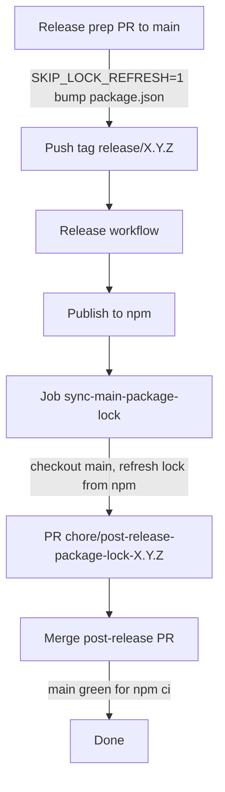

# Release guide

How to publish `@node-webrtc-rust/*` packages to npm — from your machine or via GitHub Actions.

## Packages published

| Package                        | Description                                                  |
| ------------------------------ | ------------------------------------------------------------ |
| `@node-webrtc-rust/bindings`   | Main package; downloads platform-specific optional deps      |
| `@node-webrtc-rust/bindings-*` | One package per platform (darwin/linux/win `.node` binaries) |
| `@node-webrtc-rust/signaling`  | WebSocket signaling helpers                                  |
| `@node-webrtc-rust/sdk`        | TypeScript WebRTC + conference + voice API                   |
| `@node-webrtc-rust/helpers`    | Session pod, voice session host, PCM utilities               |

Publish order (enforced by all scripts and CI): **platform bindings → bindings → signaling → sdk → helpers**.

---

## Branch vs tag naming

Use **different ref names** for prep work and publish triggers so `git push` never collides.

| Ref | Pattern | Example | Lifetime |
| --- | ------- | ------- | -------- |
| **Prep branch** (PR → `main`) | `release-prep/X.Y.Z` | `release-prep/0.5.2` | Delete after merge |
| **Publish tag** (CI trigger) | `release/X.Y.Z` | `release/0.5.2` | Permanent |

Prep branches hold CHANGELOG + `package.json` bumps. Tags point at the merged commit on `main` and trigger [`.github/workflows/release.yml`](../.github/workflows/release.yml).

**Push tags** with an explicit ref (safe even if a stale prep branch existed):

```bash
git push origin refs/tags/release/0.5.2
```

---

## One-time setup

### npm organization

Create the scope once: [npmjs.com/org/create](https://www.npmjs.com/org/create) → organization name **`node-webrtc-rust`**.

Your npm user needs publish access to the org.

### Authentication

**Local scripts:** pass a token or use `npm login`.

```bash
export NPM_TOKEN=npm_...   # Automation or Publish token with org access
npm whoami                   # verify
```

**GitHub Actions:** add repository secret **`NPM_TOKEN`** (same token type). The release workflow writes it to `~/.npmrc` before `npm publish`.

Never commit tokens. `release-local.sh` uses a temp `.npmrc_release` file (git-ignored).

### CI Docker image (`ci` branch)

Linux build and test jobs use `ghcr.io/<owner>/node-webrtc-rust/ci-build:latest`.

Pipeline details: [`scripts/ci/README.md`](ci/README.md).

Rebuild the image when `docker/ci/Dockerfile` changes:

1. Merge Dockerfile changes to the **`ci`** branch (or push directly to `ci`).
2. Wait for [CI Docker image](https://github.com/akirilyuk/node-webrtc-rust/actions/workflows/ci-image.yml) to finish.

PR and release workflows always pull `:latest`; they do not rebuild the image.

---

## Package versions in git vs npm

Two places versions matter:

| Where | When bumped | Committed to git? |
| ----- | ----------- | ----------------- |
| **npm registry** | In CI/local **immediately before** `npm publish` | No |
| **git (`package.json`)** | On the **release prep PR**, **before** the tag | **Yes — required** |

CI [`release.yml`](../.github/workflows/release.yml) always rewrites versions in the publish job workspace from the tag (`release/X.Y.Z` → `X.Y.Z`), then publishes. That ephemeral bump does **not** update `main`. If git is never bumped, the repo drifts (e.g. npm at `0.4.0`, git still at `0.1.5`).

**Rule:** committed `package.json` versions must match the version you are about to tag **before** `git push origin refs/tags/release/X.Y.Z`. Do **not** rely on a hand-edited post-publish commit on `main` for the lockfile — merge the automated post-release PR (see [Package-lock.json after release](#package-lockjson-after-release)).

**`package-lock.json`** is updated in a **separate automated PR after publish** (see [Package-lock.json after release](#package-lockjson-after-release)). Do not commit stub optional binding entries during release prep.

CI publish still runs `npm version` + `napi version` + [`set-release-deps.sh`](ci/set-release-deps.sh) before `npm publish`; release prep should already match the tag version in git.

---

## Package-lock.json after release

`@node-webrtc-rust/bindings` lists six **optional** platform packages (`bindings-darwin-arm64`, `bindings-linux-x64-gnu`, …). `package-lock.json` must record each with a full npm resolution (`version`, `resolved`, `integrity`).

If release prep runs `npm install` **before** those versions exist on npm, the lockfile can contain **stub** entries (`"optional": true` only). Then every `npm ci` fails with an opaque **`Invalid Version:`** error.

### End-to-end release flow (git + npm + lockfile)



| Step | Who | What lands on `main` |
| ---- | --- | -------------------- |
| 1. Release prep PR | Human | `CHANGELOG.md`, all `package.json` @ `X.Y.Z` (lock may be unchanged or stale — OK) |
| 2. Tag `release/X.Y.Z` | Human | Triggers [`.github/workflows/release.yml`](../.github/workflows/release.yml) |
| 3. Publish job | CI | npm packages @ `X.Y.Z` (does not commit to `main`) |
| 4. **Post-release PR** | CI (`sync-main-package-lock`) | `package-lock.json` + any version alignment from registry |
| 5. Merge post-release PR | Human | `main` valid for `npm ci` |

**Checklist after each tag:**

- [ ] Release workflow finished green (including **Publish**).
- [ ] Open and merge PR **`chore(ci): sync package-lock after release X.Y.Z`** (created automatically; see Actions run for the tag).
- [ ] Confirm **`Package-lock optional bindings`** job is green on `main` afterward.

Until step 5, `main` may fail the always-on **`validate-package-lock`** CI job — expected.

### Scripts

| Script | When to use |
| ------ | ----------- |
| [`bump-workspace-versions.sh`](ci/bump-workspace-versions.sh) | Bump all workspace `package.json` / internal pins to one version |
| [`refresh-package-lock-optional-bindings.sh`](ci/refresh-package-lock-optional-bindings.sh) | Prune stubs + `npm install` to rewrite optional binding lock entries (requires packages on npm) |
| [`validate-package-lock-optional-bindings.sh`](ci/validate-package-lock-optional-bindings.sh) | Fail fast if stubs remain (used in CI before `npm ci`) |
| [`post-release-sync-main-package-lock.sh`](ci/post-release-sync-main-package-lock.sh) | Full bump + refresh after publish (same as post-release CI job) |

**Release prep** (platform packages **not** on npm yet):

```bash
SKIP_LOCK_REFRESH=1 bash scripts/ci/bump-workspace-versions.sh 0.4.0
git add package.json packages/ examples/
git commit -m "chore(repo): release prep 0.4.0"
```

**After npm publish** (automated on tag push, or manual):

```bash
git checkout main && git pull
bash scripts/ci/post-release-sync-main-package-lock.sh 0.4.0
# commit + PR, or merge the bot PR from the Release workflow
```

**Never** hand-edit `package-lock.json` lines for `@node-webrtc-rust/bindings-*` — use `refresh-package-lock-optional-bindings.sh`.

### CI guards (always on)

| Job / hook | Workflow | Path filter |
| ---------- | -------- | ------------- |
| **`validate-package-lock`** | PR ([`build.yml`](../.github/workflows/build.yml)), push to `main` ([`build-main.yml`](../.github/workflows/build-main.yml)), tag ([`release.yml`](../.github/workflows/release.yml)) | **None — always runs** |
| Before `npm ci` | [`run-pr-quality.sh`](ci/run-pr-quality.sh), [`npm-ci-workspace.sh`](ci/npm-ci-workspace.sh), release TS verify | Same validate script |
| Pre-push | [`run-pre-push-gates.sh`](ci/run-pre-push-gates.sh) | When `package-lock.json` changed |
| **`sync-main-package-lock`** | [`release.yml`](../.github/workflows/release.yml) only | After successful **Publish** |

Local:

```bash
npm run ci:validate:package-lock
```

Pipeline details: [`scripts/ci/README.md`](ci/README.md).

### Post-release PR (automation)

Job **`Sync main package-lock (PR)`** in [`release.yml`](../.github/workflows/release.yml):

1. Runs only when **`publish`** succeeded.
2. Checks out **`main`** (not the tag ref).
3. Runs [`post-release-sync-main-package-lock.sh`](ci/post-release-sync-main-package-lock.sh) with the tag version.
4. Opens a PR via [`peter-evans/create-pull-request`](https://github.com/peter-evans/create-pull-request) — branch `chore/post-release-package-lock-X.Y.Z`, labels `dependencies`, `automation`.
5. Skips opening a PR if there is no diff.

Requires workflow permission **`pull-requests: write`**. If the org disables **“Allow GitHub Actions to create and approve pull requests”**, `GITHUB_TOKEN` cannot open the PR (the branch may still be pushed). Fix one of:

1. **Repo Settings → Actions → General** — enable **Allow GitHub Actions to create and approve pull requests**, or
2. Add repo secret **`REPO_SYNC_PAT`** (classic PAT with `repo` scope) — `release.yml` uses it for `create-pull-request`.

If automation fails, open the PR manually from branch `chore/post-release-package-lock-X.Y.Z` (compare link is printed in the failed workflow log).

### `SKIP_LOCK_REFRESH`

| Value | Behavior |
| ----- | -------- |
| `1` | [`bump-workspace-versions.sh`](ci/bump-workspace-versions.sh) updates `package.json` only — **no** lock refresh or validate (use in release prep and [`release-local.sh`](release-local.sh) before publish). |
| unset / `0` | Bump + **required** lock refresh + validate (fails if platform packages are not on npm). Used by post-release sync. |

---

## Changelog workflow

User-facing release notes live in **[`CHANGELOG.md`](../CHANGELOG.md)** at the repo root ( [Keep a Changelog](https://keepachangelog.com/) style).

| When                   | Action                                                                                                                                             |
| ---------------------- | -------------------------------------------------------------------------------------------------------------------------------------------------- |
| **During development** | Add bullets under `[Unreleased]` as PRs merge                                                                                                      |
| **Release prep PR**    | On branch `release-prep/X.Y.Z`: finalize `[X.Y.Z]`, `SKIP_LOCK_REFRESH=1` bump, PR → `main` (see [Package-lock.json after release](#package-lockjson-after-release)) |
| **On tag push**        | CI publishes npm + GitHub Release; bot opens post-release package-lock PR → merge when green; release notes via [`changelog-release-body.sh`](changelog-release-body.sh) |

Preview release notes locally:

```bash
bash scripts/changelog-release-body.sh 0.3.0
```

---

## Release via GitHub Actions (recommended)

Use this for **all six platform binaries** and a consistent CI run before publish.

### 1. Prepare release (PR — do not commit directly on `main`)

1. Feature work is already merged to **`main`** via normal PRs.
2. Create branch **`release-prep/X.Y.Z`** from `main` (e.g. `release-prep/0.5.2`).
3. On that branch:
   - Finalize [`CHANGELOG.md`](../CHANGELOG.md): `[Unreleased]` → `[X.Y.Z] — YYYY-MM-DD`, new empty `[Unreleased]`.
   - Bump **all** publishable package versions and internal pins to `X.Y.Z` with `SKIP_LOCK_REFRESH=1` (see [Package versions in git vs npm](#package-versions-in-git-vs-npm)). Do **not** commit a broken `package-lock.json` from a pre-publish refresh.
4. Open PR **`release-prep/X.Y.Z` → `main`**, wait for Build & Test green, **merge**.
5. Delete the prep branch locally and on origin (avoids confusion with the tag name).

### 2. Tag and publish (after merge)

Tag the **merge commit** on `main` (`package.json` versions must already be `X.Y.Z`; lockfile sync comes **after** publish):

```bash
git checkout main
git pull
git tag release/0.5.2
git push origin refs/tags/release/0.5.2
```

### 3. Merge post-release package-lock PR

When the Release workflow finishes, merge the automated PR **`chore(ci): sync package-lock after release X.Y.Z`** → `main`. See [checklist](#end-to-end-release-flow-git--npm--lockfile).

Supported **tag** forms (not branch names):

```text
release/0.2.0
release/0.2.0-beta.1
release/0.2.0-rc.1
```

The segment after `release/` must match committed `package.json` versions. CI uses the tag for publish metadata and re-applies the same bump in the runner before `npm publish`.

### What the workflow does

[`.github/workflows/release.yml`](../.github/workflows/release.yml):

1. **Build** — full matrix (3× Linux in CI container, macOS ×2, Windows ×1)
2. **Test** — format, lint, typecheck, `cargo test`, `npm test` (with coturn)
3. **Publish** — stage artifacts, bump versions in workspace, build TS, publish to npm (including `@node-webrtc-rust/helpers`)
4. **GitHub Release** — creates a release with the matching section from `CHANGELOG.md`
5. **Sync main package-lock** — checks out `main`, runs [`post-release-sync-main-package-lock.sh`](ci/post-release-sync-main-package-lock.sh), opens PR `chore/post-release-package-lock-X.Y.Z` → `main` (merge when green)

Required secrets: **`NPM_TOKEN`**, **`GITHUB_TOKEN`** (publish, release, and automated PR).

Release prep PR bumps git `package.json` versions; the **post-release PR** updates `package-lock.json` from npm so `main` stays valid for `npm ci`. Merge that PR promptly after each tag.

### Catch-up: repo behind npm (e.g. after 0.4.0 without a version PR)

If npm already has `X.Y.Z` but git does not:

1. Branch from `main` (e.g. `chore/sync-versions-0.4.0`).
2. Run post-release sync (packages already on npm):

   ```bash
   bash scripts/ci/post-release-sync-main-package-lock.sh 0.4.0
   ```
3. PR → `main`, merge.
4. Then run the normal [prepare release](#1-prepare-release-pr--do-not-commit-directly-on-main) flow for the next version (`0.4.1`, etc.).

---

## Local release

Two scripts live under `scripts/`. Pick based on how many platforms you can build locally.

### Quick release — current platform only

[`release-local.sh`](release-local.sh) — best for **patch releases** when only your host `.node` matters, or for testing the publish flow.

```bash
./scripts/release-local.sh <version> <npm-token> [--dry-run] [--otp=CODE]
```

Examples:

```bash
./scripts/release-local.sh 0.2.0 "$NPM_TOKEN" --dry-run
./scripts/release-local.sh 0.2.0 "$NPM_TOKEN" --otp=123456
```

Behavior:

- Detects host OS/arch and looks for a matching `.node` in `packages/bindings/`, `prebuilt/`, or `artifacts/`
- Rebuilds with `npm run build:local` only if missing
- Bumps all package versions via [`bump-workspace-versions.sh`](ci/bump-workspace-versions.sh) with `SKIP_LOCK_REFRESH=1` before publish
- Publishes **only platform packages that have a `.node` file** (typically one on a dev machine)
- Verifies the native binding loads before publish

After a successful publish (for CI releases, versions are already on `main` from the prep PR):

```bash
bash scripts/ci/post-release-sync-main-package-lock.sh 0.2.0
git add -A && git commit -m "chore(repo): sync package-lock after release 0.2.0"
git tag release/0.2.0 && git push origin refs/tags/release/0.2.0
```

Pushing the tag on GitHub also runs the automated post-release PR on `main` ([Package-lock.json after release](#package-lockjson-after-release)).

Prefer the [GitHub Actions](#release-via-github-actions-recommended) PR + tag flow so publish and lock sync stay consistent.

### Full release — all six platforms (macOS)

[`release-publish.sh`](release-publish.sh) — builds Linux + macOS on a Mac; **Windows `.node` must be supplied** (CI artifact or manual build).

```bash
export NPM_TOKEN=npm_...
./scripts/release-publish.sh <version> [--dry-run] [--force-build] [--otp=CODE]
# or: npm run release:publish -- 0.2.0
```

Prerequisites on macOS: Docker (optional for Linux-only CI verify), `cmake`, `zig`, Rust stable with cross targets.

Place prebuilt binaries under any of:

- `packages/bindings/node-webrtc-rust.<platform>.node` (see `index.js` naming)
- `packages/bindings/prebuilt/bindings-<rust-triple>/`
- `packages/bindings/artifacts/bindings-<rust-triple>/` (populated by the script)

Windows is never cross-compiled locally — copy from a Windows CI artifact or build on Windows, then re-run.

---

## Pre-release checks

Release NAPI builds (CI `release.yml`, `build-main.yml`, and [`release-publish.sh`](release-publish.sh)) always pass **`--features otel`** so published `@node-webrtc-rust/bindings` include OpenTelemetry. Local `npm run build:native` / PR debug builds do not unless you pass the feature explicitly.

Mirror PR CI locally:

```bash
npm run ci:validate:package-lock # fast lockfile check (no npm ci)
npm run build:native             # host .node for npm test
npm run ci:verify                # full PR check suite on host
npm run ci:verify:release-ts     # release publish TS path
npm run ci:verify:linux          # optional: native matrix cross-builds in Docker
```

Dry-run publish packaging on a PR: the **Publish (dry-run)** job in [Build & Test](../.github/workflows/build.yml) runs `npm publish --dry-run --workspaces` when native or TS code changes.

---

## Troubleshooting

| Issue | Fix |
| ----- | --- |
| `npm ci` / CI **`Invalid Version:`** | Stub optional bindings in `package-lock.json`. Run `npm run ci:validate:package-lock` to list stubs. After packages are on npm: `bash scripts/ci/refresh-package-lock-optional-bindings.sh` or merge the post-release PR. |
| `main` red after release prep, before post-release PR | Expected until **`chore/post-release-package-lock-X.Y.Z`** merges. Do not “fix” by hand-editing stubs. |
| `bump-workspace-versions.sh` fails on refresh | Use `SKIP_LOCK_REFRESH=1` before publish; run `post-release-sync-main-package-lock.sh` after publish. |
| No post-release PR after tag | Check Release workflow job **Sync main package-lock**; verify `publish` succeeded and `pull-requests: write` permission. Re-run locally: `bash scripts/ci/post-release-sync-main-package-lock.sh X.Y.Z` on `main`. |
| Post-release PR conflicts | Rebase branch on `main`, or close bot PR and run sync script locally. |
| `shopt: not found` in CI | Linux container steps use `shell: bash` |
| `EOTP` / 2FA on npm | Re-run local script with `--otp=123456` |
| `403` on scoped publish | Scripts use `npm publish --access public` |
| Double publish of platform pkgs | Publish main bindings with `--ignore-scripts` |
| Missing Windows binary locally | CI release tag workflow or add `node-webrtc-rust.win32-x64-msvc.node` |
| Zig / Opus link errors on Linux | `OPUS_STATIC=1` and `CMAKE_POLICY_VERSION_MINIMUM=3.5` |
