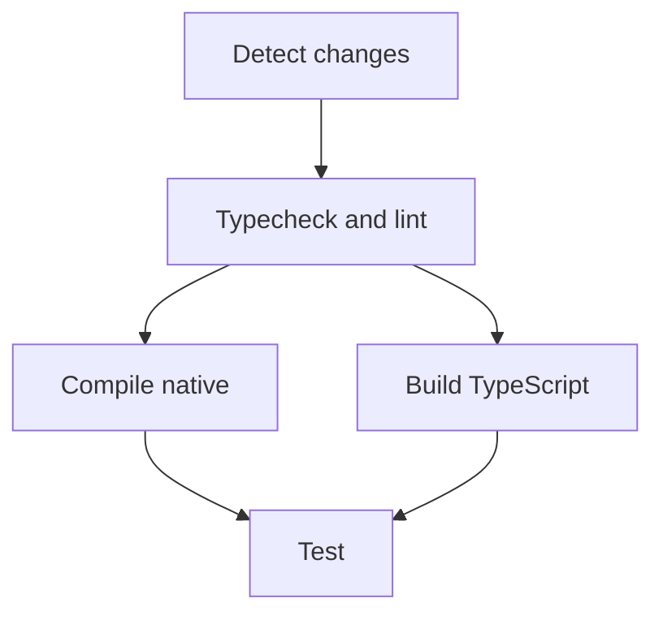
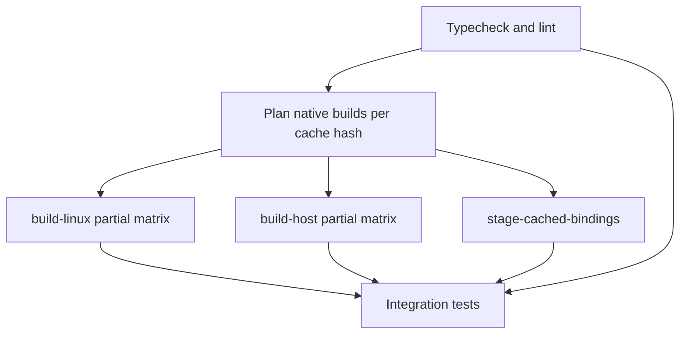
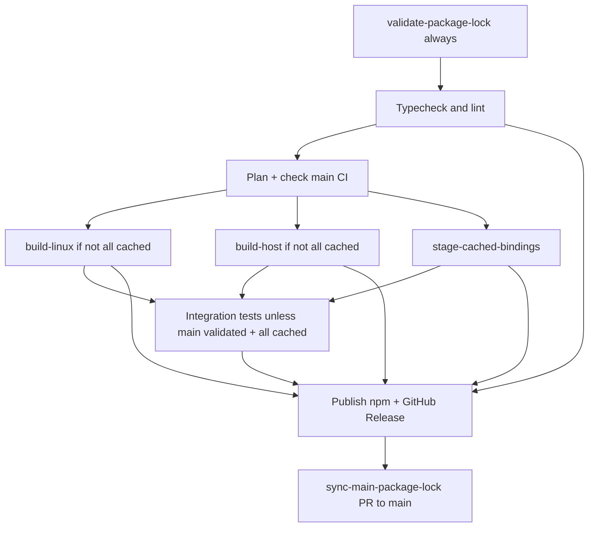

# CI pipelines

Human-readable reference for GitHub Actions workflows, reusable jobs, caches, and local mirrors.

**When you change anything under `.github/`, `scripts/ci/`, or `docker/ci/`**, update this file in the same PR.

---

## Overview

| Workflow                | File                                                                         | Trigger         | Purpose                                                            |
| ----------------------- | ---------------------------------------------------------------------------- | --------------- | ------------------------------------------------------------------ |
| **Build & Test (PR)**   | [`.github/workflows/build.yml`](../../.github/workflows/build.yml)           | PR → `main`     | Path-filtered quality, native compile, TS build, integration tests |
| **Build & Test (main)** | [`.github/workflows/build-main.yml`](../../.github/workflows/build-main.yml) | Push → `main`   | Full release native matrix + full test suite                       |
| **Release**             | [`.github/workflows/release.yml`](../../.github/workflows/release.yml)       | Tag `release/*` | Release matrix → tests → npm publish → GitHub Release              |

Every workflow above starts with **`validate-package-lock`** (no path filter) — fails in seconds if `package-lock.json` has stub optional `@node-webrtc-rust/bindings-*` entries. Local: `npm run ci:validate:package-lock`.
| **CI Docker image** | [`.github/workflows/ci-image.yml`](../../.github/workflows/ci-image.yml) | Push → `ci`, `workflow_dispatch` | Publish `ghcr.io/.../ci-build:latest` |

Reusable workflows (called via `workflow_call`, not triggered directly):

| File                                                                           | Role                                                           |
| ------------------------------------------------------------------------------ | -------------------------------------------------------------- |
| [`reusable-build-linux.yml`](../../.github/workflows/reusable-build-linux.yml) | Linux release matrix (gnu, musl, arm64)                        |
| [`reusable-build-host.yml`](../../.github/workflows/reusable-build-host.yml)   | macOS + Windows release matrix                                 |
| [`reusable-test.yml`](../../.github/workflows/reusable-test.yml)               | Download binding artifact → cache fallback → host Docker tests |

Composite actions live in [`.github/actions/`](../../.github/actions/).

## Runners

| Platform               | `runs-on`                                  | Workflows                                                                                       |
| ---------------------- | ------------------------------------------ | ----------------------------------------------------------------------------------------------- |
| Linux x64 (gnu + musl) | `self-hosted` + `ci-build` container       | PR compile-native, Linux x64 release matrix, integration tests, CI image build, release publish |
| Linux arm64 (gnu)      | `ubuntu-24.04-arm` (GitHub-hosted, native) | Linux release matrix only                                                                       |
| macOS                  | `macos-latest`                             | Release host matrix (darwin x64 + arm64)                                                        |
| Windows                | `windows-latest`                           | Release host matrix (x64)                                                                       |

**Linux gnu x64** builds natively on the self-hosted runner without `napi --zig` so Sherpa/ONNX static objects link correctly (`__cpu_features2`). **Linux x64 musl** builds natively in **`ghcr.io/.../ci-build-alpine:latest`** with **musl Sherpa shared libs** (`build-sherpa-onnx-musl-libs.sh` + Alpine `onnxruntime-dev`); `vendor-sherpa-onnx` selects `sherpa-onnx/shared` via `target_env = "musl"` — the default `sherpa-onnx-sys` glibc static prebuilts fail on Alpine (`__strdup: symbol not found`). CI sets `SHERPA_ONNX_LIB_DIR=/opt/sherpa-musl/lib` **only on the musl job** (gnu/arm64 must not export an empty value). CI runs `verify-musl-runtime.sh` after musl builds. **Linux arm64 gnu** builds on GitHub-hosted ARM runners (native compile, no Zig cross) to avoid build-script `ring` arch mismatches.

The self-hosted runner must have **Docker** (runner user in the `docker` group). Container jobs and test `docker run` leave root-owned files; host jobs run an inline **Docker `chown`** prepare step before checkout (no passwordless sudo required).

---

## PR pipeline (`build.yml`)



### 1. Detect changes

Uses [`dorny/paths-filter@v3`](https://github.com/dorny/paths-filter) with these outputs:

| Output             | Paths (summary)                                                                                      |
| ------------------ | ---------------------------------------------------------------------------------------------------- |
| `native`           | `Cargo.*`, `crates/**`, `packages/bindings/**` (excluding generated `.node` / loader and `**/*.md`)  |
| `typescript`       | `packages/sdk/**`, `packages/signaling/**`, lockfile, tsconfigs, eslint, prettier (excluding `*.md`) |
| `helpers`          | `packages/helpers/**`, `examples/voice-agent-local-sherpa-multi-client/**` (excluding `*.md`)        |
| `examples`         | `examples/**` (excluding `*.md`)                                                                     |
| `workflows`        | `.github/**`, `docker/ci/**`, `scripts/ci/**` (excluding `*.md`) — **quality** only (cheap)          |
| `workflows_native` | Native compile actions, `native-binding-cache`, `docker/ci/**`, cache-key + surface verify scripts   |
| `workflows_test`   | Integration-test action, `reusable-test.yml`, `run-pr-integration.sh`, Sherpa CI scripts             |
| `workflows_ts`     | `ci-cache-ts-dist`, `build-ts-workspace.sh`, TS dist cache key / release TS verify scripts           |

If `code` is false (docs-only), **Typecheck & lint**, **Compile native**, **Build TypeScript**, and **Test** still run as required checks but exit immediately (skip notice). No checkout, setup-node, artifact download, or integration tests.

Markdown under `docs/**` and any `**/*.md` file do not set `code=true` — README edits under `crates/**` or `examples/**` no longer trigger heavy jobs.

### 2. Package-lock optional bindings (always)

- **When:** every PR (always runs; not path-filtered)
- **Job:** `validate-package-lock` → [`.github/actions/validate-package-lock`](../../.github/actions/validate-package-lock/action.yml)
- **Script:** [`validate-package-lock-optional-bindings.sh`](validate-package-lock-optional-bindings.sh) — no `npm ci`; blocks merge before opaque `Invalid Version:` errors

### 3. Typecheck & lint

- **Always runs** on every PR (for branch-protection required checks).
- **When:** `code` OR `workflows` — otherwise the job succeeds immediately after a skip notice (no checkout or setup-node).
- **When running:** [`run-pr-quality.sh`](run-pr-quality.sh) on self-hosted runner.
- **Runner:** `self-hosted` + `actions/setup-node@v20` (not `ci-build` — fast, no GHCR pull)
- **Script:** [`run-pr-quality.sh`](run-pr-quality.sh) → [`validate-package-lock-optional-bindings.sh`](validate-package-lock-optional-bindings.sh), `npm ci`, `fix-rollup-native.sh`, typecheck ([`tsconfig.typecheck.json`](tsconfig.typecheck.json)), `eslint`, helpers vitest, [`run-sherpa-example-ci.sh typecheck`](run-sherpa-example-ci.sh)
- Runs [`build-ts-workspace.sh`](build-ts-workspace.sh) inside [`run-helpers-unit-tests.sh`](run-helpers-unit-tests.sh) when sdk/signaling/helpers `dist/` is missing (fresh CI checkout). Job 4 still builds once for Test cache.

Must pass before compile / TS build / test. Runs **in parallel** with compile-native when both are needed.

**Compile native** runs when `native` or `workflows_native` paths change. Cache key (`native-v2-*`) fingerprints **bindings Rust sources**, **all dependent crates linked into bindings** (core, mixer, conference, speech, vendor-*), **`Cargo.lock`**, and committed **`packages/bindings/index.d.ts`** (NAPI surface). No `restore-keys` prefix fallback. After restore, `verify-native-binding-surface.mjs --target <triple>` checks the platform `.node` for that matrix row (runtime on matching host arch, static string scan for cross-compiles); stale caches are deleted and compile runs. TS-only PRs skip compile and reuse a validated cache in Test.

### 4. Compile native

- **Always runs** on every PR (for branch-protection required checks).
- **When:** `native` OR `workflows_native` — otherwise the job succeeds immediately after a skip notice (no checkout, no compile).
- **When compiling:** requires **Typecheck & lint** success.
- **Runner:** `ci-build` container
- **Target:** `x86_64-unknown-linux-gnu` debug
- **Cache:** [`native-binding-cache`](../../.github/actions/native-binding-cache) restores a prior `.node` for the Test job, but **compile always runs `napi build`** when this job is not skipped (`skip_build_on_cache_hit: false`). Cache key (`native-v2-*`) fingerprints **bindings Rust sources**, **every `path = "../../crates/…"` dep in `packages/bindings/Cargo.toml`**, **`Cargo.lock`**, and committed **`packages/bindings/index.d.ts`**. No `restore-keys` prefix fallback.
- **Action:** [`ci-build-native-linux`](../../.github/actions/ci-build-native-linux) — host-style build runs `copy:local-node` so `index.js` loads the fresh `.node` instead of stale optional npm packages

Populates the shared native cache used by the test job.

### 5. Build TypeScript

- **Always runs** on every PR (for branch-protection required checks).
- **When:** `typescript` OR `helpers` OR `examples` OR `workflows_ts` — otherwise the job succeeds immediately after a skip notice (no checkout, setup-node, or cache).
- **When building:** requires **Typecheck & lint** success.
- **Needs:** quality only (runs **in parallel** with compile-native — TS build does not need `.node`)
- **Runner:** `self-hosted` + `setup-node`
- **Cache:** [`ci-cache-ts-dist`](../../.github/actions/ci-cache-ts-dist) → `packages/sdk/dist`, `packages/signaling/dist`, `packages/helpers/dist`
- **On cache miss:** `npm ci`, `fix-rollup-native.sh`, [`build-ts-workspace.sh`](build-ts-workspace.sh) (sdk core → signaling → full sdk → helpers)

Single CI build of publishable `dist/` for the Test job. Release-publish compile parity: [`verify-release-publish-ts.sh`](verify-release-publish-ts.sh) locally or `release.yml` publish job.

### 6. Test

- **Always runs** on every PR (for branch-protection required checks).
- **When:** no source path filter matched — succeeds immediately (`skip: 'true'`). CI-only YAML edits do not run integration tests.
- **When source code changed:** requires **Typecheck & lint** success (when it ran); restores `.node` / TS `dist/` only when needed.
- **Workflow:** [`reusable-test.yml`](../../.github/workflows/reusable-test.yml)
- **Script:** [`run-pr-integration.sh`](run-pr-integration.sh)

Before tests, the test job receives the native binding from the **same workflow run**:

1. **Primary:** download `bindings-x86_64-unknown-linux-gnu` artifact when **compile-native** ran in this workflow (`ran_compile` output). Skipped when compile was gated off (docs-only, TS-only, test-CI-only PRs).
2. **Fallback:** [`native-binding-cache`](../../.github/actions/native-binding-cache) when artifact download is skipped or failed (e.g. TS-only PR).
3. **Verify:** assert `packages/bindings/*.node` exists before tests (no silent `napi build` in CI).
4. TS `dist/` via [`ci-cache-ts-dist`](../../.github/actions/ci-cache-ts-dist).

Jobs do not share a workspace on self-hosted runners (each job checks out fresh). Only the `.node` binding is passed compile → test via artifact (~48 MB). `cargo test` runs inside the ci-build container and compiles Rust test deps there (registry cached via prior compile job on the same workspace is not shared across jobs).

**Last resort inside the test script** (no artifact and no cache):

- Compile debug `.node` if missing
- Run `build:ts` if `dist/` missing

Test execution: runner **host Docker** → public `coturn/coturn:latest` sidecar → tests run inside prebuilt `ci-build` via `docker run --network container:coturn`. A prepare step resets workspace ownership before checkout (container jobs write root-owned files).

**TURN test networking:** peers and coturn share the test container network namespace (`--network container:coturn`). Traffic stays on loopback / Docker — **no inbound ports on the host firewall** (80/443 nginx is unrelated). coturn uses UDP/TCP **3478** for TURN control and **49152–65535** for relay allocations inside the container only. CI enables `--allow-loopback-peers` because both WebRTC peers run on the same host.

### Sherpa roundtrip E2E (integration job)

After `cargo test` and `npm test`, [`run-pr-integration.sh`](run-pr-integration.sh) runs [`run-sherpa-example-ci.sh e2e`](run-sherpa-example-ci.sh):

1. Download STT (`sherpa-onnx-streaming-zipformer-en-kroko-2025-08-06`) and TTS (`vits-piper-en_US-amy-low`) into `examples/voice-agent-local-sherpa/.models/`
2. Set `SHERPA_STT_MODEL_PATH` / `SHERPA_TTS_MODEL_PATH`
3. Run each `start:roundtrip*` script in order (exit on first failure). Each step uses [`run-sherpa-roundtrip-e2e.sh`](run-sherpa-roundtrip-e2e.sh): streams **`[speech]` events** (browser parity) with **`[voice-debug]` / topology off**; **automatic re-run with `VOICE_DEBUG=1`** if that pass fails. Wrapped in [`run-with-timeout.sh`](run-with-timeout.sh) (default **180s** per script; override `CI_SHERPA_ROUNDTRIP_TIMEOUT_SEC`). Model downloads cap at **900s** (`CI_SHERPA_MODEL_DOWNLOAD_TIMEOUT_SEC`).

| Quality job ([`run-pr-quality.sh`](run-pr-quality.sh))                              | Integration job ([`run-pr-integration.sh`](run-pr-integration.sh)) |
| ----------------------------------------------------------------------------------- | ------------------------------------------------------------------ |
| Sherpa example `tsc`                                                                | Same models + native `.node` as browser demo                       |
| Vitest: `npm run test:roundtrip-counting` (evaluators only — **no Sherpa weights**) | Full E2E below                                                     |

| #   | npm script                                | Purpose                                                  |
| --- | ----------------------------------------- | -------------------------------------------------------- |
| 1   | `start:roundtrip-counting`                | One long count 1–20 → **1×** `user_speech_final`         |
| 2   | `start:roundtrip-utterance-timing`        | `user_speaking_end` → `user_speech_final` within 500 ms  |
| 3   | `start:roundtrip-two-phrases`             | Two phrases → **2×** finals (multi-turn)                 |
| 4   | `start:roundtrip-barge-in`                | Semantic barge-in (tone vs spoken interrupt)             |
| 5   | `start:roundtrip-counting-echo`           | Agent1↔Agent2 “You said” echo (counting + long sentence) |
| 6   | `start:roundtrip-counting-barge-recovery` | Full echo → barge truncate → recovery                    |
| 7   | `start:roundtrip`                         | Five default phrases + word similarity                   |

**Local mirror (models + `npm run build:native` first):**

```bash
cd node-webrtc-rust
bash scripts/ci/run-sherpa-example-ci.sh vitest   # quality parity, no models
bash scripts/ci/run-sherpa-example-ci.sh e2e      # all seven E2E scripts
bash scripts/ci/run-pr-tests-full.sh              # quality + integration (full PR test job)
```

**Local mirror of the PR Test job (host — recommended):**

```bash
cd node-webrtc-rust
npm run build:native                           # host .node for npm test
npm run ci:verify:pr-full                      # quality + integration
npm run ci:verify:checks                       # full suite incl. format + release TS parity
CI_STEP_LOG_TS=1 npm run ci:verify:pr-full     # UTC timestamps on [ci-step] lines
```

**Optional Docker parity** (coturn + ci-build container — only when debugging remote runner differences):

```bash
cd node-webrtc-rust
npm run ci:verify:pr-test:docker              # integration only (cargo + npm test + Sherpa E2E)
npm run ci:verify:pr-full:docker              # quality + integration
CI_STEP_LOG_TS=1 npm run ci:verify:pr-test:docker   # UTC timestamps on [ci-step] lines
```

Step banners: `[ci-step] START (3/7) sherpa e2e start:roundtrip-barge-in` → `OK (25s)` or `FAIL` / timeout hint.  
Sherpa stderr during E2E: `[topology]` (signaling / agent-pc / user-pc attach), `[e2e-phase]`, `[speech]` (listener events), `[voice-debug]` (Rust STT/VAD). See [`ROUNDTRIP.md`](../../examples/voice-agent-local-sherpa/ROUNDTRIP.md) § Debug logging.

**Pre-push (scoped):** `npm run ci:pre-push` runs Sherpa typecheck + Vitest + E2E when `examples/voice-agent-local-sherpa/` or `crates/speech/` changed — see [`run-pre-push-gates.sh`](run-pre-push-gates.sh).

Details, env vars, and debug logging: [`examples/voice-agent-local-sherpa/ROUNDTRIP.md`](../../examples/voice-agent-local-sherpa/ROUNDTRIP.md).

---

## Main push pipeline (`build-main.yml`)

Triggered on every push to `main`.



1. **quality** — [`run-pr-quality.sh`](run-pr-quality.sh)
2. **plan** — [`plan-native-builds`](../../.github/actions/plan-native-builds) queries GitHub Actions cache for exact `native-v2-release-{target}-{hash}` keys; outputs build matrices only for **missing** targets
3. **build-linux-x64 / build-linux-arm64 / build-host** — compile **only** targets without cache (skipped when matrix empty)
4. **stage-cached-bindings** — restore `.node` from cache and upload `bindings-*` artifacts for cached targets (so release publish can download all six)
5. **test** — [`run-pr-integration.sh`](run-pr-integration.sh)

No path filtering — always validates release surface after merge, but skips compile for warm per-target caches.

---

## Release pipeline (`release.yml`)

Prep PRs use branch `release-prep/x.y.z` → `main`. Publish is triggered by `git push origin refs/tags/release/x.y.z`. Full release + lockfile docs: [`scripts/RELEASE.md`](../RELEASE.md#package-lockjson-after-release).



1. **validate-package-lock** — always (no path filter); [`validate-package-lock-optional-bindings.sh`](validate-package-lock-optional-bindings.sh)
2. **quality** — [`run-pr-quality.sh`](run-pr-quality.sh)
3. **plan** — per-target cache check + [`check-main-ci-success.sh`](check-main-ci-success.sh) (successful `build-main.yml` for this SHA)
4. **build-linux / build-host** — skipped when **all** targets cached; otherwise compile **only missing** targets
5. **stage-cached-bindings** — upload artifacts for cached targets
6. **test** — **skipped** when `all_cached && main_validated` (A1); otherwise [`run-pr-integration.sh`](run-pr-integration.sh)
7. **publish** — stage artifacts, `npm publish`, GitHub Release
8. **sync-main-package-lock** — checkout `main`, [`post-release-sync-main-package-lock.sh`](post-release-sync-main-package-lock.sh), open PR `chore/post-release-package-lock-X.Y.Z` (merge promptly — see RELEASE.md)

Release prep on git uses `SKIP_LOCK_REFRESH=1` with [`bump-workspace-versions.sh`](bump-workspace-versions.sh); post-publish sync runs full bump + [`refresh-package-lock-optional-bindings.sh`](refresh-package-lock-optional-bindings.sh).

---

## CI Docker images

| Image | Dockerfile | Used for |
| ----- | ---------- | -------- |
| `ghcr.io/<owner>/node-webrtc-rust/ci-build:latest` | [`docker/ci/Dockerfile`](../../docker/ci/Dockerfile) | glibc native builds (Linux gnu x64), PR compile-native, integration tests |
| `ghcr.io/<owner>/node-webrtc-rust/ci-build-alpine:latest` | [`docker/ci/Dockerfile.alpine`](../../docker/ci/Dockerfile.alpine) | **musl** native builds (`x86_64-unknown-linux-musl`) |

**ci-build:** Ubuntu 24.04, Node 20, Rust stable + Linux cross targets, Zig (napi `--zig` for non-gnu targets).  
**ci-build-alpine:** Node 24 Alpine, Rust + musl toolchain via [`install-alpine-native-toolchain.sh`](install-alpine-native-toolchain.sh).

Rebuild when either Dockerfile (or the Alpine install script) changes:

```bash
# Preferred: push to ci branch, or merge docker/ci changes to main (path-filtered workflow)
git push origin ci

# Or: Actions → CI Docker image → Run workflow (workflow_dispatch)
```

If release prep bumps versions before platform packages are on npm, run:

```bash
SKIP_LOCK_REFRESH=1 bash scripts/ci/bump-workspace-versions.sh <version>
bash scripts/ci/sync-lock-workspace-versions.sh   # keeps lock workspace versions in sync
```

After publish: `bash scripts/ci/refresh-package-lock-optional-bindings.sh` (or merge the post-release PR).

**Before the first musl CI run after adding `Dockerfile.alpine`:** publish `ci-build-alpine:latest` (merge to `main` or push `ci`, then wait for **CI Docker image** workflow). Musl jobs disable npm cache (BusyBox `tar` lacks GNU `-P`).

**Native build env:** `audiopus_sys` needs static Opus + CMake policy shim. Set `OPUS_STATIC=1` and `CMAKE_POLICY_VERSION_MINIMUM=3.5` on reusable build workflows and in [`ci-build-native-*`](../../.github/actions/) build steps (caller workflow `env` does not propagate into `workflow_call` jobs).

---

## Scripts reference

| Script                                                                                     | Used by                                                 | What it runs                                                                                                                                                     |
| ------------------------------------------------------------------------------------------ | ------------------------------------------------------- | ---------------------------------------------------------------------------------------------------------------------------------------------------------------- |
| [`bump-workspace-versions.sh`](bump-workspace-versions.sh)                                 | Release prep (`SKIP_LOCK_REFRESH=1`), post-release sync | Bump workspace `package.json` / pins; optional lock refresh + validate                                                                                           |
| [`refresh-package-lock-optional-bindings.sh`](refresh-package-lock-optional-bindings.sh)   | After publish, via bump or post-release sync            | Prune stub optional bindings + `npm install`                                                                                                                     |
| [`validate-package-lock-optional-bindings.sh`](validate-package-lock-optional-bindings.sh) | `validate-package-lock` job, before every `npm ci`      | Fail fast on stub optional `@node-webrtc-rust/bindings-*` lock entries (`Invalid Version:`)                                                                      |
| [`post-release-sync-main-package-lock.sh`](post-release-sync-main-package-lock.sh)         | Release `sync-main-package-lock` job after publish      | Bump + refresh lock from npm; workflow opens PR to `main`                                                                                                        |
| [`run-pr-quality.sh`](run-pr-quality.sh)                                                   | PR quality job                                          | lock validate, `npm ci`, **`fix-rollup-native.sh`**, typecheck, lint, **`run-helpers-unit-tests.sh`**, Sherpa typecheck + **roundtrip Vitest**                   |
| [`run-helpers-unit-tests.sh`](run-helpers-unit-tests.sh)                                   | quality job, `npm run test:helpers`                     | vitest `@node-webrtc-rust/helpers` + multi-client example (no `.node`)                                                                                           |
| [`run-pre-push-gates.sh`](run-pre-push-gates.sh)                                           | `npm run ci:pre-push`                                   | eslint + build-ts + helpers vitest when scoped; Sherpa **typecheck + Vitest + E2E** when example/speech changes                                                  |
| [`install-pre-push-hook.sh`](install-pre-push-hook.sh)                                     | one-time per clone                                      | installs `.git/hooks/pre-push` → `npm run ci:pre-push`                                                                                                           |
| [`run-if-helpers-changed.sh`](run-if-helpers-changed.sh)                                   | alias                                                   | → `run-pre-push-gates.sh`                                                                                                                                        |
| [`plan-native-builds.sh`](plan-native-builds.sh)                                           | main + release plan job                                 | Per-target cache hash check → dynamic build matrices                                                                                                             |
| [`check-main-ci-success.sh`](check-main-ci-success.sh)                                     | release plan job                                        | Skip release test when main validated same SHA                                                                                                                   |
| [`list-release-targets.sh`](list-release-targets.sh)                                       | plan / stage scripts                                    | Canonical six release triples                                                                                                                                    |
| [`verify-release-publish-ts.sh`](verify-release-publish-ts.sh)                             | Local release publish TS parity                         | `npm ci --ignore-scripts`, version bump, `build-ts-workspace.sh`                                                                                                 |
| [`build-ts-workspace.sh`](build-ts-workspace.sh)                                           | PR build-ts + integration fallback                      | sdk core → signaling → full sdk                                                                                                                                  |
| [`run-pr-integration.sh`](run-pr-integration.sh)                                           | PR test job                                             | [`npm-ci-workspace.sh`](npm-ci-workspace.sh), cargo test (incl. speech), optional build:ts, npm test, [`run-sherpa-example-ci.sh e2e`](run-sherpa-example-ci.sh) |
| [`run-sherpa-example-ci.sh`](run-sherpa-example-ci.sh)                                     | quality (`typecheck`, `vitest`) + test (`e2e`)          | Sherpa `tsc`; **all** `test:roundtrip-counting` Vitest; **all** `start:roundtrip-*` E2E after model download                                                     |
| [`run-sherpa-roundtrip-e2e.sh`](run-sherpa-roundtrip-e2e.sh)                               | via `run-sherpa-example-ci.sh e2e`                      | CI pass streams `[speech]` events; `[voice-debug]` off unless re-run on failure                                                                                  |
| [`ci-step.sh`](ci-step.sh)                                                                 | integration + Sherpa E2E                                | `[ci-step] START/OK/FAIL` banners; optional `--timeout` via [`run-with-timeout.sh`](run-with-timeout.sh)                                                         |
| [`run-with-timeout.sh`](run-with-timeout.sh)                                               | via `ci-step.sh`                                        | GNU `timeout` / `gtimeout` wall-clock cap per step                                                                                                               |
| [`run-pr-test-job-docker.sh`](run-pr-test-job-docker.sh)                                   | `npm run ci:verify:pr-test:docker`                      | **Optional** coturn + ci-build container → `run-pr-integration.sh`                                                                                               |
| [`run-pr-tests-full.sh`](run-pr-tests-full.sh)                                             | `npm run ci:verify:pr-full`                             | quality + integration (host)                                                                                                                                     |
| [`run-pr-integration.sh`](run-pr-integration.sh)                                           | main + release test                                     | integration only (after quality job)                                                                                                                             |
| [`verify-checks.sh`](verify-checks.sh)                                                     | `npm run ci:verify:checks*`                             | Local mirror of quality + integration                                                                                                                            |
| [`ensure-workspace-bindings.sh`](ensure-workspace-bindings.sh)                             | via [`npm-ci-workspace.sh`](npm-ci-workspace.sh)        | Remove nested registry `bindings` copies so `npm test` loads workspace `.node`                                                                                   |
| [`verify-linux.sh`](verify-linux.sh)                                                       | `npm run ci:verify:linux`                               | Local release cross-builds in Docker                                                                                                                             |

---

## Local validation

Run these **before pushing CI changes** (see [`.cursor/rules/ci-local-validation.mdc`](../../.cursor/rules/ci-local-validation.mdc)):

```bash
npm run build:native                           # host .node for npm test
bash scripts/ci/run-pr-quality.sh              # PR quality job
bash scripts/ci/verify-release-publish-ts.sh   # release publish TS path
npm run ci:verify:release-ts                     # same as verify-release-publish-ts.sh
bash scripts/ci/build-ts-workspace.sh          # PR build-ts job (from clean dist/)
npm run ci:verify:pr-full                        # quality + integration (host)
npm run ci:verify:checks                         # full PR check suite (host)
npm run ci:verify                                # alias for ci:verify:checks
npm run ci:verify:linux                          # optional: release Linux cross-builds in Docker
```

**Optional Docker parity** (remote ci-build container only):

```bash
npm run ci:verify:checks:docker
npm run ci:verify:release-ts:docker
npm run ci:verify:pr-test:docker
npm run ci:docker:build                        # build ci-build image locally
```

After changing `docker/ci/Dockerfile`, rebuild and push to the `ci` branch before expecting Linux CI jobs to pick up toolchain changes.

---

## Caching summary

| Cache                      | Key inputs                             | Paths                      | Used in                                        |
| -------------------------- | -------------------------------------- | -------------------------- | ---------------------------------------------- |
| Native binding             | `Cargo.lock`, crates, bindings sources | `packages/bindings/*.node` | compile-native, release/main/host matrix, test |
| TS dist                    | sdk/signaling sources + tsconfigs      | `packages/*/dist`          | build-ts, test                                 |
| npm                        | `package-lock.json`                    | `node_modules`             | setup-node jobs                                |
| Rust target (restore-only) | `Cargo.lock`, workspace `Cargo.toml` (per target label) | `target/` | compile/build-linux warm start only; **no cross-label restore-keys**; `rm -rf target` when cache key is not an exact hit (avoids stale artifacts after feature/toolchain changes) |

PR native cache profile: **debug** (`v1-pr-debug`). Main/release: **release** (`v2-release` — bumped after Sherpa link-static/shared split in #55).

---

## Composite actions

| Action                                                                       | Purpose                                                                                                                |
| ---------------------------------------------------------------------------- | ---------------------------------------------------------------------------------------------------------------------- |
| [`native-binding-cache`](../../.github/actions/native-binding-cache)         | Restore + validate `.node`; [`ci-build-native-linux`](../../.github/actions/ci-build-native-linux) saves after compile |
| [`ci-build-native-linux`](../../.github/actions/ci-build-native-linux)       | Cache, npm, napi build, upload artifact                                                                                |
| [`ci-build-native-host`](../../.github/actions/ci-build-native-host)         | Node + Rust setup, napi build, upload                                                                                  |
| [`ci-cache-ts-dist`](../../.github/actions/ci-cache-ts-dist)                 | sdk/signaling `dist/` cache                                                                                            |
| [`ci-run-integration-tests`](../../.github/actions/ci-run-integration-tests) | GHCR login, coturn sidecar, ci-build test run                                                                          |
