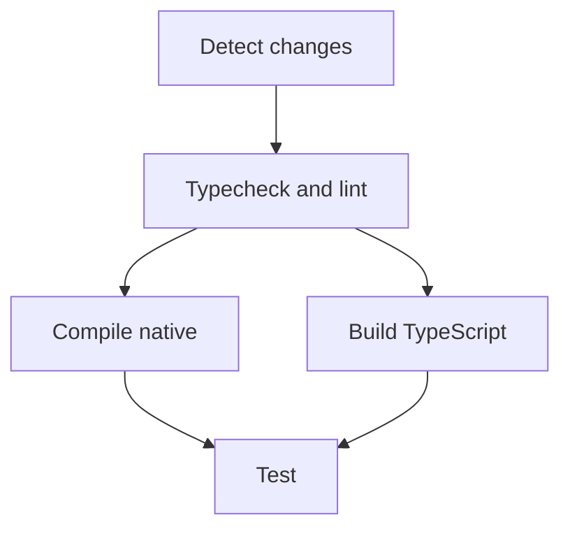
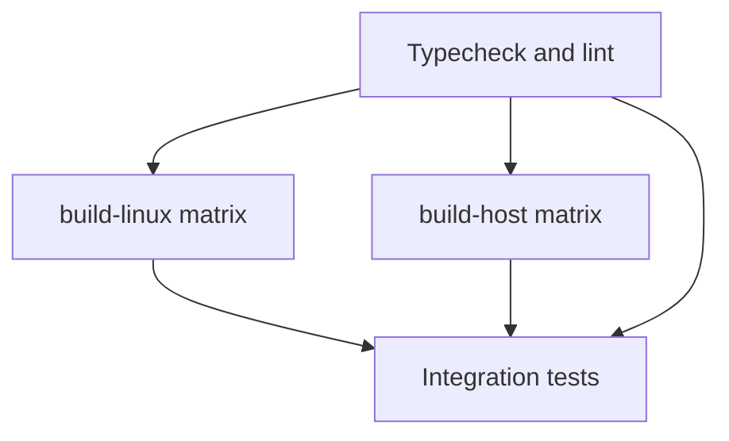
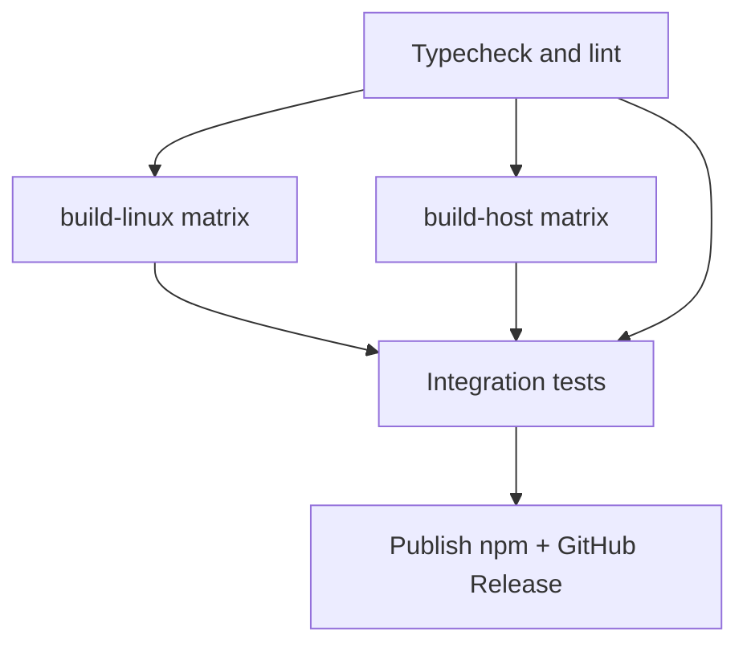

# CI pipelines

Human-readable reference for GitHub Actions workflows, reusable jobs, caches, and local mirrors.

**When you change anything under `.github/`, `scripts/ci/`, or `docker/ci/`**, update this file in the same PR.

---

## Overview

| Workflow | File | Trigger | Purpose |
|----------|------|---------|---------|
| **Build & Test (PR)** | [`.github/workflows/build.yml`](../../.github/workflows/build.yml) | PR → `main` | Path-filtered quality, native compile, TS build, integration tests |
| **Build & Test (main)** | [`.github/workflows/build-main.yml`](../../.github/workflows/build-main.yml) | Push → `main` | Full release native matrix + full test suite |
| **Release** | [`.github/workflows/release.yml`](../../.github/workflows/release.yml) | Tag `release/*` | Release matrix → tests → npm publish → GitHub Release |
| **CI Docker image** | [`.github/workflows/ci-image.yml`](../../.github/workflows/ci-image.yml) | Push → `ci`, `workflow_dispatch` | Publish `ghcr.io/.../ci-build:latest` |

Reusable workflows (called via `workflow_call`, not triggered directly):

| File | Role |
|------|------|
| [`reusable-build-linux.yml`](../../.github/workflows/reusable-build-linux.yml) | Linux release matrix (gnu, musl, arm64) |
| [`reusable-build-host.yml`](../../.github/workflows/reusable-build-host.yml) | macOS + Windows release matrix |
| [`reusable-test.yml`](../../.github/workflows/reusable-test.yml) | Download binding artifact → cache fallback → host Docker tests |

Composite actions live in [`.github/actions/`](../../.github/actions/).

## Runners

| Platform | `runs-on` | Workflows |
|----------|-----------|-----------|
| Linux x64 | `self-hosted` | PR pipeline, Linux release matrix, integration tests, CI image build, release publish |
| macOS | `macos-latest` | Release host matrix (darwin x64 + arm64) |
| Windows | `windows-latest` | Release host matrix (x64) |

The self-hosted runner must have **Docker** (runner user in the `docker` group). Container jobs and test `docker run` leave root-owned files; host jobs run an inline **Docker `chown`** prepare step before checkout (no passwordless sudo required).

---

## PR pipeline (`build.yml`)



### 1. Detect changes

Uses [`dorny/paths-filter@v3`](https://github.com/dorny/paths-filter) with three outputs:

| Output | Paths (summary) |
|--------|-----------------|
| `native` | `Cargo.*`, `crates/**`, `packages/bindings/**` (excluding generated `.node` / loader) |
| `typescript` | `packages/sdk/**`, `packages/signaling/**`, lockfile, tsconfigs, eslint, prettier |
| `workflows` | `.github/**`, `docker/ci/**` |

If none match, the whole workflow is skipped.

### 2. Typecheck & lint

- **When:** `native` OR `typescript` OR `workflows`
- **Runner:** `self-hosted` + `actions/setup-node@v20` (not `ci-build` — fast, no GHCR pull)
- **Script:** [`run-pr-quality.sh`](run-pr-quality.sh) → `npm ci`, unified typecheck ([`tsconfig.typecheck.json`](tsconfig.typecheck.json)), `eslint`

Must pass before compile / TS build / test.

**Compile native** also runs when **TypeScript** changes (`packages/sdk`, `packages/signaling`) so the Test job always gets a fresh `.node` artifact — TS-only commits must not reuse a stale binding missing new NAPI exports.

### 3. Compile native

- **When:** `native` OR `workflows` (skipped on TS-only PRs)
- **Runner:** `ci-build` container
- **Target:** `x86_64-unknown-linux-gnu` debug
- **Cache:** [`native-binding-cache`](../../.github/actions/native-binding-cache) — skips `napi build` on cache hit
- **Action:** [`ci-build-native-linux`](../../.github/actions/ci-build-native-linux)

Populates the shared native cache used by the test job.

### 4. Build TypeScript

- **When:** `typescript` OR `workflows` (skipped on Rust-only PRs)
- **Runner:** `self-hosted` + `setup-node`
- **Cache:** [`ci-cache-ts-dist`](../../.github/actions/ci-cache-ts-dist) → `packages/sdk/dist`, `packages/signaling/dist`
- **Build:** `npm run build:ts` only on cache miss via [`build-ts-workspace.sh`](build-ts-workspace.sh) (3-phase: sdk core → signaling → full sdk)

Vitest tests import from `src/`, but this step validates publishable `dist/` output when TS changes. The sdk↔signaling cycle (`conference/signaling-bridge.ts`) requires bootstrapping sdk without `conference/` before signaling can build.

### 5. Test

- **When:** quality success; compile-native and build-ts success or skipped; at least one path filter matched
- **Workflow:** [`reusable-test.yml`](../../.github/workflows/reusable-test.yml)
- **Script:** [`run-pr-integration.sh`](run-pr-integration.sh)

Before tests, the test job receives the native binding from the **same workflow run**:

1. **Primary:** download `bindings-x86_64-unknown-linux-gnu` artifact uploaded by `compile-native` (PR) or `build-linux` (main/release). Fails the job when compile ran but the artifact is missing.
2. **Fallback:** [`native-binding-cache`](../../.github/actions/native-binding-cache) only when artifact download is skipped or failed (e.g. TS-only PR).
3. **Verify:** assert `packages/bindings/*.node` exists before tests (no silent `napi build` in CI).
4. TS `dist/` via [`ci-cache-ts-dist`](../../.github/actions/ci-cache-ts-dist).

Jobs do not share a workspace on self-hosted runners (each job checks out fresh). Only the `.node` binding is passed compile → test via artifact (~48 MB). `cargo test` runs inside the ci-build container and compiles Rust test deps there (registry cached via prior compile job on the same workspace is not shared across jobs).

**Last resort inside the test script** (no artifact and no cache):

- Compile debug `.node` if missing
- Run `build:ts` if `dist/` missing

Test execution: runner **host Docker** → public `coturn/coturn:latest` sidecar → tests run inside prebuilt `ci-build` via `docker run --network container:coturn`. A prepare step resets workspace ownership before checkout (container jobs write root-owned files).

**TURN test networking:** peers and coturn share the test container network namespace (`--network container:coturn`). Traffic stays on loopback / Docker — **no inbound ports on the host firewall** (80/443 nginx is unrelated). coturn uses UDP/TCP **3478** for TURN control and **49152–65535** for relay allocations inside the container only. CI enables `--allow-loopback-peers` because both WebRTC peers run on the same host.

---

## Main push pipeline (`build-main.yml`)

Triggered on every push to `main`.



1. **quality** — [`run-pr-quality.sh`](run-pr-quality.sh) (must pass before native compile)
2. **build-linux** / **build-host** — release matrix; skip `napi build` per target on native cache hit
3. **test** — [`run-pr-integration.sh`](run-pr-integration.sh) only (quality already ran)

No path filtering — always validates the full release surface after merge.

---

## Release pipeline (`release.yml`)

Triggered by `git push origin release/x.y.z`.



1. **quality** — [`run-pr-quality.sh`](run-pr-quality.sh) (must pass before any native compile)
2. **build-linux** / **build-host** — same reusable workflows (`cache_prefix: v1-release`); per-target compile skipped on native cache hit
3. **test** — [`run-pr-integration.sh`](run-pr-integration.sh) only (quality already ran)
4. **publish** — runs only when quality, both build workflows, and test all **succeeded**; stage artifacts, `npm publish`, poll registry via [`wait-for-npm-package.sh`](wait-for-npm-package.sh), GitHub Release

See [`scripts/RELEASE.md`](../RELEASE.md) for tagging and secrets.

---

## CI Docker image

**Image:** `ghcr.io/<owner>/node-webrtc-rust/ci-build:latest`  
**Dockerfile:** [`docker/ci/Dockerfile`](../../docker/ci/Dockerfile)  
**Contents:** Ubuntu 24.04, Node 20, Rust stable + Linux cross targets, Zig (napi `--zig`)

Rebuild when the Dockerfile changes:

```bash
# push to ci branch, or workflow_dispatch on ci-image.yml
git push origin ci
```

Used by: PR compile-native, release Linux matrix, integration test container.

**Native build env:** `audiopus_sys` needs static Opus + CMake policy shim. Set `OPUS_STATIC=1` and `CMAKE_POLICY_VERSION_MINIMUM=3.5` on reusable build workflows and in [`ci-build-native-*`](../../.github/actions/) build steps (caller workflow `env` does not propagate into `workflow_call` jobs).

---

## Scripts reference

| Script | Used by | What it runs |
|--------|---------|--------------|
| [`run-pr-quality.sh`](run-pr-quality.sh) | PR quality job | `npm ci`, typecheck, lint |
| [`build-ts-workspace.sh`](build-ts-workspace.sh) | PR build-ts + integration fallback | sdk core → signaling → full sdk |
| [`run-pr-integration.sh`](run-pr-integration.sh) | PR test job | [`npm-ci-workspace.sh`](npm-ci-workspace.sh), cargo test, optional build:ts, npm test |
| [`run-pr-tests-full.sh`](run-pr-tests-full.sh) | local `ci:verify` | quality + integration |
| [`run-pr-integration.sh`](run-pr-integration.sh) | main + release test | integration only (after quality job) |
| [`verify-checks.sh`](verify-checks.sh) | `npm run ci:verify:checks*` | Local mirror of quality + integration |
| [`verify-linux.sh`](verify-linux.sh) | `npm run ci:verify:linux` | Local release cross-builds in Docker |

---

## Local validation

Run these **before pushing CI changes** (see [`.cursor/rules/ci-local-validation.mdc`](../../.cursor/rules/ci-local-validation.mdc)):

```bash
bash scripts/ci/run-pr-quality.sh     # PR quality job
bash scripts/ci/build-ts-workspace.sh # PR build-ts job (from clean dist/)
npm run ci:verify:checks:docker       # quality + integration in ci-build image
npm run ci:verify:linux               # release Linux cross-builds
npm run ci:verify                     # both verify targets
npm run ci:docker:build               # build ci-build image locally
```

After changing `docker/ci/Dockerfile`, rebuild and push to the `ci` branch before expecting Linux CI jobs to pick up toolchain changes.

---

## Caching summary

| Cache | Key inputs | Paths | Used in |
|-------|------------|-------|---------|
| Native binding | `Cargo.lock`, crates, bindings sources | `packages/bindings/*.node` | compile-native, release/main/host matrix, test |
| TS dist | sdk/signaling sources + tsconfigs | `packages/*/dist` | build-ts, test |
| npm | `package-lock.json` | `node_modules` | setup-node jobs |
| Rust target (restore-only) | `Cargo.lock`, workspace | `target/` | compile/build-linux warm start only |

PR native cache profile: **debug**. Main/release: **release**.

---

## Composite actions

| Action | Purpose |
|--------|---------|
| [`native-binding-cache`](../../.github/actions/native-binding-cache) | Per-target `.node` restore/save |
| [`ci-build-native-linux`](../../.github/actions/ci-build-native-linux) | Cache, npm, napi build, upload artifact |
| [`ci-build-native-host`](../../.github/actions/ci-build-native-host) | Node + Rust setup, napi build, upload |
| [`ci-cache-ts-dist`](../../.github/actions/ci-cache-ts-dist) | sdk/signaling `dist/` cache |
| [`ci-run-integration-tests`](../../.github/actions/ci-run-integration-tests) | GHCR login, coturn sidecar, ci-build test run |
