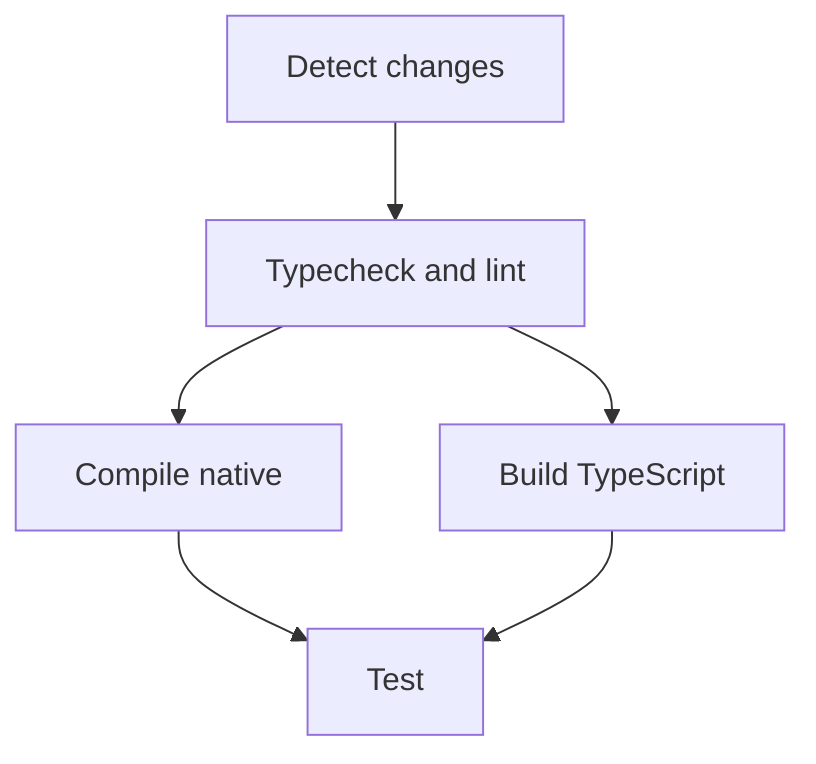
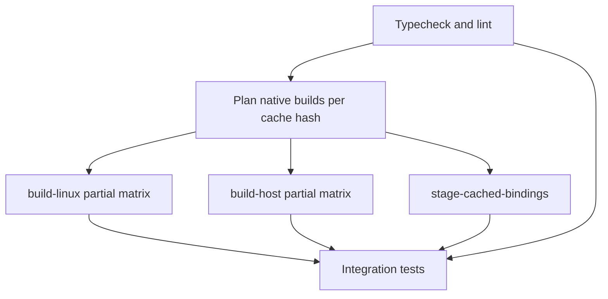
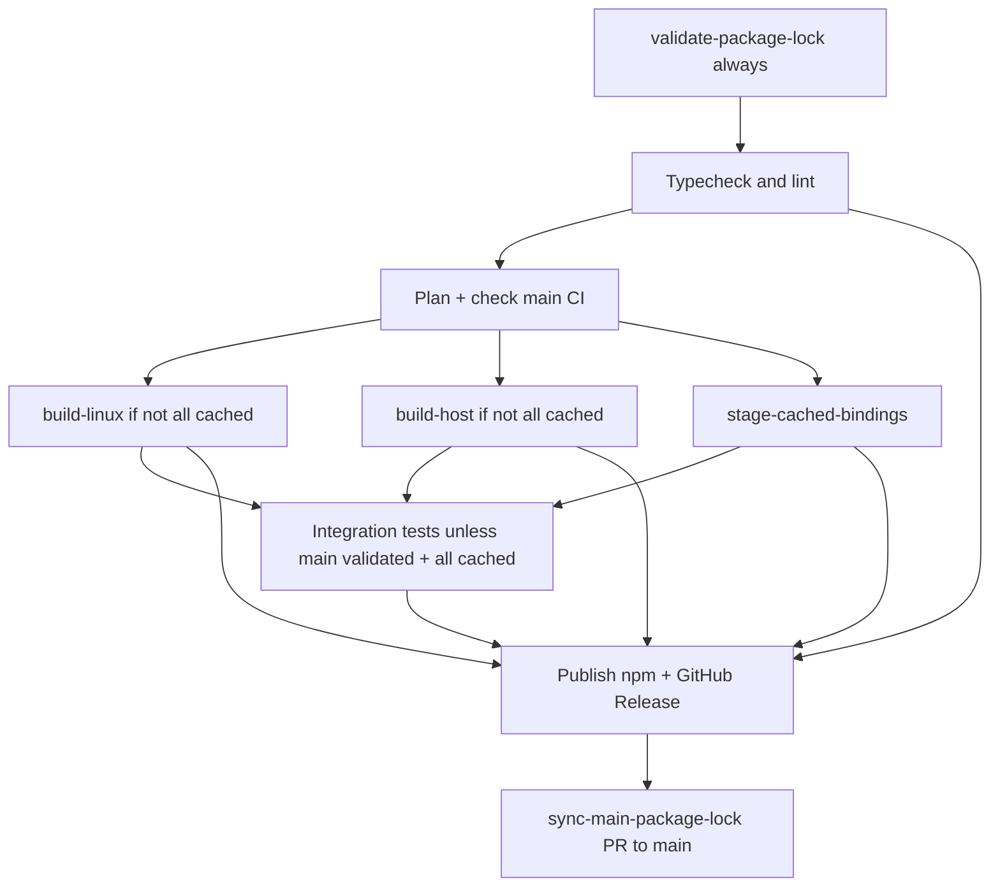

# CI pipelines

Human-readable reference for GitHub Actions workflows, reusable jobs, caches, and local mirrors.

**When you change anything under `.github/`, `scripts/ci/`, or `docker/ci/`**, update this file in the same PR.

---

## Overview

| Workflow                | File                                                                                         | Trigger                              | Purpose                                                               |
| ----------------------- | -------------------------------------------------------------------------------------------- | ------------------------------------ | --------------------------------------------------------------------- |
| **Build & Test (PR)**   | [`.github/workflows/build.yml`](../../.github/workflows/build.yml)                           | PR → `main`                          | Path-filtered quality, native compile, TS build, integration tests    |
| **Build & Test (main)** | [`.github/workflows/build-main.yml`](../../.github/workflows/build-main.yml)                 | Push → `main`                        | Full release native matrix + full test suite + `native-main-bundle`   |
| **Release**             | [`.github/workflows/release.yml`](../../.github/workflows/release.yml)                       | Tag `release/*`                      | Resolve/reuse main bundle → tests → npm publish → GitHub Release      |
| **CI Docker image**     | [`.github/workflows/ci-image.yml`](../../.github/workflows/ci-image.yml)                     | Push → `ci`/`main` (paths), dispatch | Publish `ci-build` + `ci-build-alpine` (`:latest` + immutable `:SHA`) |
| **Native cache smoke**  | [`.github/workflows/native-cache-smoke.yml`](../../.github/workflows/native-cache-smoke.yml) | **`workflow_dispatch` only**         | Non-publishing cache reuse + release-style resolve (see below)        |

Every PR/main/release workflow starts with **`validate-package-lock`** (no path filter) — fails in seconds if `package-lock.json` has stub optional `@node-webrtc-rust/bindings-*` entries. Local: `npm run ci:validate:package-lock`.

Reusable workflows (called via `workflow_call`, not triggered directly):

| File                                                                           | Role                                                           |
| ------------------------------------------------------------------------------ | -------------------------------------------------------------- |
| [`reusable-build-linux.yml`](../../.github/workflows/reusable-build-linux.yml) | Linux release matrix (gnu, musl, arm64)                        |
| [`reusable-build-host.yml`](../../.github/workflows/reusable-build-host.yml)   | macOS + Windows release matrix                                 |
| [`reusable-test.yml`](../../.github/workflows/reusable-test.yml)               | Download binding artifact → cache fallback → host Docker tests |

Composite actions live in [`.github/actions/`](../../.github/actions/).

## Concurrency (cancel in-progress)

PR and main build workflows use GitHub `concurrency` with `cancel-in-progress: true` so a new push to the same PR (or to `main`) cancels the previous in-flight run and starts a fresh one with the updated commit.

| Workflow                | Group key              | Cancel in progress             |
| ----------------------- | ---------------------- | ------------------------------ |
| **Build & Test (PR)**   | `build-pr-<PR number>` | yes                            |
| **Build & Test (main)** | `build-main-<ref>`     | yes                            |
| **CI Docker image**     | `ci-image-<ref>`       | yes                            |
| **Release**             | _(none)_               | no — do not cancel mid-publish |

## Runners

| Platform               | `runs-on`                                  | Workflows                                                                                       |
| ---------------------- | ------------------------------------------ | ----------------------------------------------------------------------------------------------- |
| Linux x64 (gnu + musl) | `self-hosted` + `ci-build` container       | PR compile-native, Linux x64 release matrix, integration tests, CI image build, release publish |
| Linux arm64 (gnu)      | `ubuntu-24.04-arm` (GitHub-hosted, native) | Linux release matrix only                                                                       |
| macOS                  | `macos-latest`                             | Release host matrix (darwin x64 + arm64)                                                        |
| Windows                | `windows-latest`                           | Release host matrix (x64)                                                                       |

**Linux gnu x64** builds natively on the self-hosted runner without `napi --zig` so Sherpa/ONNX static objects link correctly (`__cpu_features2`). **Linux x64 musl** builds natively in **`ghcr.io/.../ci-build-alpine:latest`** with **musl Sherpa shared libs** (`build-sherpa-onnx-musl-libs.sh` + Alpine `onnxruntime-dev`); `vendor-sherpa-onnx` selects `sherpa-onnx/shared` via `target_env = "musl"` — the default `sherpa-onnx-sys` glibc static prebuilts fail on Alpine (`__strdup: symbol not found`). CI sets `SHERPA_ONNX_LIB_DIR=/opt/sherpa-musl/lib` **only on the musl job** (gnu/arm64 must not export an empty value). CI runs `verify-musl-runtime.sh` after musl builds. **Linux arm64 gnu** builds on GitHub-hosted ARM runners (native compile, no Zig cross) to avoid build-script `ring` arch mismatches.

The self-hosted runner must have **Docker** (runner user in the `docker` group). Container jobs and test `docker run` leave root-owned files; host jobs run an inline **Docker `chown`** prepare step before checkout (no passwordless sudo required).

---

## PR pipeline (`build.yml`)


```mermaid
flowchart TD
  changes[Detect changes]
  quality[Typecheck and lint]
  compile[Compile native]
  ts[Build TypeScript]
  test[Test]

  changes --> quality
  quality --> compile
  quality --> ts
  compile --> test
  ts --> test
```

### 1. Detect changes

[`compute-pr-job-gates.sh`](compute-pr-job-gates.sh) sets `run_compile` / `run_test` / … from:

1. **`merge-base..pull_request.head.sha`** (full PR diff — not `github.sha`, which is a synthetic merge commit)
2. **Files in the latest head commit** (`git diff-tree`) so a push that only edits `crates/speech/**` still forces native compile + integration tests
3. **`dorny/paths-filter` `native` / `workflows_native`** as a fallback

Local check: `bash scripts/ci/compute-pr-job-gates.test.sh`

Uses [`dorny/paths-filter@v3`](https://github.com/dorny/paths-filter) with these outputs:

| Output             | Paths (summary)                                                                                      |
| ------------------ | ---------------------------------------------------------------------------------------------------- |
| `native`           | `Cargo.*`, `crates/**`, `packages/bindings/**` (excluding generated `.node` / loader and `**/*.md`)  |
| `typescript`       | `packages/sdk/**`, `packages/signaling/**`, lockfile, tsconfigs, eslint, prettier (excluding `*.md`) |
| `helpers`          | `packages/helpers/**`, `examples/voice-agent-local-sherpa-multi-client/**` (excluding `*.md`)        |
| `examples`         | `examples/**` (excluding `*.md`)                                                                     |
| `workflows`        | `.github/**`, `docker/ci/**`, `scripts/ci/**` (excluding `*.md`) — **quality** only (cheap)          |
| `workflows_native` | Native compile actions, `native-binding-cache`, `docker/ci/**`, cache-key + surface verify scripts   |
| `workflows_test`   | Integration-test action, `reusable-test.yml`, `run-pr-integration.sh`, Sherpa CI scripts             |
| `workflows_ts`     | `ci-cache-ts-dist`, `build-ts-workspace.sh`, TS dist cache key / release TS verify scripts           |

If `code` is false (docs-only), **Typecheck & lint**, **Compile native**, **Build TypeScript**, and **Test** still run as required checks but exit immediately (skip notice). No checkout, setup-node, artifact download, or integration tests.

Markdown under `docs/**` and any `**/*.md` file do not set `code=true` — README edits under `crates/**` or `examples/**` no longer trigger heavy jobs.

### 2. Package-lock optional bindings (always)

- **When:** every PR (always runs; not path-filtered)
- **Job:** `validate-package-lock` → [`.github/actions/validate-package-lock`](../../.github/actions/validate-package-lock/action.yml)
- **Script:** [`validate-package-lock-optional-bindings.sh`](validate-package-lock-optional-bindings.sh) — no `npm ci`; blocks merge before opaque `Invalid Version:` errors

### 3. Typecheck & lint

- **Always runs** on every PR (for branch-protection required checks).
- **When:** `code` OR `workflows` — otherwise the job succeeds immediately after a skip notice (no checkout or setup-node).
- **When running:** [`run-pr-quality.sh`](run-pr-quality.sh) on self-hosted runner.
- **Runner:** `self-hosted` + `actions/setup-node@v20` (not `ci-build` — fast, no GHCR pull)
- **Script:** [`run-pr-quality.sh`](run-pr-quality.sh) → [`validate-package-lock-optional-bindings.sh`](validate-package-lock-optional-bindings.sh), `npm ci`, `fix-rollup-native.sh`, typecheck ([`tsconfig.typecheck.json`](tsconfig.typecheck.json)), `eslint`, helpers vitest, [`run-sherpa-example-ci.sh typecheck`](run-sherpa-example-ci.sh)
- Runs [`build-ts-workspace.sh`](build-ts-workspace.sh) inside [`run-helpers-unit-tests.sh`](run-helpers-unit-tests.sh) when sdk/signaling/helpers `dist/` is missing (fresh CI checkout). Job 4 still builds once for Test cache.

Must pass before compile / TS build / test. Runs **in parallel** with compile-native when both are needed.

**Compile native** runs when Rust/bindings or byte-affecting compile recipe/toolchain paths change. Cache, manifest, bundle, resolver, planner, and fingerprint implementation edits do **not** trigger Rust compilation or alter the native digest. Cache keys use `native-v3-{profile}-{target}-{input_digest}` from [`native-build-fingerprint.sh`](native-build-fingerprint.sh) / [`native_build_contract.py`](native_build_contract.py) (see [Native fingerprint & provenance](#native-fingerprint--provenance-foundation)). No `restore-keys` prefix fallback. After restore, `verify-native-binding-surface.mjs --target <triple>` checks the platform `.node` for that matrix row (runtime on matching host arch, static string scan for cross-compiles); stale caches are deleted and compile runs. TS-only PRs skip compile and reuse a validated cache in Test. Same-repo PRs have `actions: write` so compile/TS/Sherpa misses can save caches; fork PR caches stay isolated from the base branch by GitHub.

### 4. Compile native

- **Always runs** on every PR (for branch-protection required checks).
- **When:** `native` OR `workflows_native` — otherwise the job succeeds immediately after a skip notice (no checkout, no compile).
- **When compiling:** requires **Typecheck & lint** success.
- **Runner:** `ci-build` container
- **Target:** `x86_64-unknown-linux-gnu` debug
- **Cache:** [`native-binding-cache`](../../.github/actions/native-binding-cache) restores + validates a prior `.node`. On hit, [`ci-build-native-linux`](../../.github/actions/ci-build-native-linux) skips `napi build` but still **uploads the artifact** for Test (`workflow_call` jobs often cannot restore the same GHA cache). On miss, compile, save cache, upload. Cache key fingerprints bindings Rust sources, every `path = "../../crates/…"` dep, `Cargo.lock`, committed NAPI surface (`index.d.ts`, `index.js`), and bindings `package.json` **excluding top-level `version`**. No `restore-keys` prefix fallback.
- **npm:** no GHA `~/.npm` cache — bindings `npm ci --omit=optional` only installs `@napi-rs/cli` (~6MB, typically &lt;1s). Caching `~/.npm` previously re-uploaded multi-GB polluted stores in Post.
- **Action:** [`ci-build-native-linux`](../../.github/actions/ci-build-native-linux) — host-style build runs `copy:local-node` so `index.js` loads the fresh `.node` instead of stale optional npm packages

Uploads `bindings-x86_64-unknown-linux-gnu` for the Test job when compile-native ran.

### 5. Build TypeScript

- **Always runs** on every PR (for branch-protection required checks).
- **When:** `typescript` OR `helpers` OR `examples` OR `workflows_ts` — otherwise the job succeeds immediately after a skip notice (no checkout, setup-node, or cache).
- **When building:** requires **Typecheck & lint** success.
- **Needs:** quality only (runs **in parallel** with compile-native — TS build does not need `.node`)
- **Runner:** `self-hosted` + `setup-node`
- **Cache:** [`ci-cache-ts-dist`](../../.github/actions/ci-cache-ts-dist) → `packages/sdk/dist`, `packages/signaling/dist`, `packages/helpers/dist`
- **On cache miss:** `npm ci`, `fix-rollup-native.sh`, [`build-ts-workspace.sh`](build-ts-workspace.sh) (sdk core → signaling → full sdk → helpers)

Single CI build of publishable `dist/` for the Test job. Release-publish compile parity: [`verify-release-publish-ts.sh`](verify-release-publish-ts.sh) locally or `release.yml` publish job.

### 6. Test

- **Always runs** on every PR (for branch-protection required checks).
- **Required check name:** a thin `Test` job in [`build.yml`](../../.github/workflows/build.yml) propagates the reusable workflow result. `workflow_call` jobs alone report as `Integration tests / Test`, which does **not** satisfy the required `Test` context.
- **When:** no source path filter matched — succeeds immediately (`skip: 'true'`). CI-only YAML edits do not run integration tests.
- **When source code changed:** requires **Typecheck & lint** success (when it ran); restores `.node` / TS `dist/` only when needed.
- **Workflow:** [`reusable-test.yml`](../../.github/workflows/reusable-test.yml) (called as **Integration tests**)
- **Script:** [`run-pr-integration.sh`](run-pr-integration.sh)

Before tests, the test job receives the native binding as follows:

1. **Primary:** download `bindings-x86_64-unknown-linux-gnu` when **compile-native** ran (`ran_compile`). Compile restores from GHA cache on hit (skips `napi build`) or compiles on miss, then always uploads the artifact — required because `reusable-test` (`workflow_call`) often cannot restore the same GHA cache.
2. **Fallback:** [`native-binding-cache`](../../.github/actions/native-binding-cache) when compile was gated off (docs-only / TS-only / test-CI-only).
3. **Verify:** assert `packages/bindings/*.node` exists before tests (no silent `napi build` in CI).
4. TS `dist/` via [`ci-cache-ts-dist`](../../.github/actions/ci-cache-ts-dist) (`ts_dist_profile: pr` on PR builds).

Jobs do not share a workspace on self-hosted runners (each job checks out fresh). Artifact handoff is ~162 MB. **`cargo test`** runs inside the ci-build container and compiles Rust **test** deps in a separate profile from the NAPI addon — there is no `target/` handoff between jobs; compile-native’s Cargo `target/` cache applies only on cache-miss builds in that job.

**Last resort locally only** (not CI — `run-pr-integration.sh` exits if `.node` is missing when `CI=true`):

- Compile debug `.node` if missing
- Run `build:ts` if `dist/` missing

Local contract checks: `bash scripts/ci/native-build-fingerprint.test.sh`, `bash scripts/ci/native-artifact-manifest.test.sh`, `bash scripts/ci/check-release-targets.test.sh`, `bash scripts/ci/native-binding-cache-key.test.sh`

Test execution: runner **host Docker** → public `coturn/coturn:latest` sidecar → tests run inside prebuilt `ci-build` via `docker run --network container:coturn`. A prepare step resets workspace ownership before checkout (container jobs write root-owned files).

**TURN test networking:** peers and coturn share the test container network namespace (`--network container:coturn`). Traffic stays on loopback / Docker — **no inbound ports on the host firewall** (80/443 nginx is unrelated). coturn uses UDP/TCP **3478** for TURN control and **49152–65535** for relay allocations inside the container only. CI enables `--allow-loopback-peers` because both WebRTC peers run on the same host.

### Sherpa roundtrip E2E (integration job)

After `cargo test` and `npm test`, [`run-pr-integration.sh`](run-pr-integration.sh) runs [`run-sherpa-example-ci.sh e2e`](run-sherpa-example-ci.sh):

1. Download STT (`sherpa-onnx-streaming-zipformer-en-kroko-2025-08-06`) and TTS (`vits-piper-en_US-amy-low`) into `examples/voice-agent-local-sherpa/.models/`
2. Set `SHERPA_STT_MODEL_PATH` / `SHERPA_TTS_MODEL_PATH`
3. Run ignored Rust vendor tests that need those weights: `cargo test -p node-webrtc-rust-vendor-sherpa-onnx --test tts_phrase_cache_test -- --ignored` (asserts ONNX `generate` is skipped on cache hit). Timeout **420s** (`CI_SHERPA_RUST_IGNORED_TIMEOUT_SEC`). Models-only path: `bash scripts/ci/run-sherpa-example-ci.sh rust`.
4. Run each `start:roundtrip*` script in order (exit on first failure). Each step uses [`run-sherpa-roundtrip-e2e.sh`](run-sherpa-roundtrip-e2e.sh): streams **`[speech]` events** (browser parity) with **`[voice-debug]` / topology off**; **automatic re-run with `VOICE_DEBUG=1`** if that pass fails. Wrapped in [`run-with-timeout.sh`](run-with-timeout.sh) (default **180s** per script; override `CI_SHERPA_ROUNDTRIP_TIMEOUT_SEC`). Model downloads cap at **900s** (`CI_SHERPA_MODEL_DOWNLOAD_TIMEOUT_SEC`).

| Quality job ([`run-pr-quality.sh`](run-pr-quality.sh))                              | Integration job ([`run-pr-integration.sh`](run-pr-integration.sh)) |
| ----------------------------------------------------------------------------------- | ------------------------------------------------------------------ |
| Sherpa example `tsc`                                                                | Same models + native `.node` as browser demo                       |
| Vitest: `npm run test:roundtrip-counting` (evaluators only — **no Sherpa weights**) | Full E2E below                                                     |

| #   | npm script                                | Purpose                                                  |
| --- | ----------------------------------------- | -------------------------------------------------------- |
| 1   | `start:roundtrip-counting`                | One long count 1–20 → **1×** `user_speech_final`         |
| 2   | `start:roundtrip-utterance-timing`        | `user_speaking_end` → `user_speech_final` within 500 ms  |
| 3   | `start:roundtrip-two-phrases`             | Two phrases → **2×** finals (multi-turn)                 |
| 4   | `start:roundtrip-barge-in`                | Semantic barge-in (streaming TTS; tone vs spoken)        |
| 5   | `start:roundtrip-barge-in-buffered`       | Same barge-in harness with `VOICE_TTS_STREAM_CHUNKS=0`   |
| 6   | `start:roundtrip-counting-echo`           | Agent1↔Agent2 “You said” echo (counting + long sentence) |
| 7   | `start:roundtrip-counting-barge-recovery` | Full echo → barge truncate → recovery                    |
| 8   | `start:roundtrip`                         | Five default phrases + word similarity                   |

**Local mirror (models + `npm run build:native` first):**

```bash
cd node-webrtc-rust
bash scripts/ci/run-sherpa-example-ci.sh vitest   # quality parity, no models
bash scripts/ci/run-sherpa-example-ci.sh rust     # download models + TTS phrase-cache ignored cargo tests
bash scripts/ci/run-sherpa-example-ci.sh e2e      # models + phrase-cache tests + all roundtrip E2E scripts
bash scripts/ci/run-pr-tests-full.sh              # quality + integration (full PR test job)
```

**Local mirror of the PR Test job (host — recommended):**

```bash
cd node-webrtc-rust
npm run build:native                           # host .node for npm test
npm run ci:verify:pr-full                      # quality + integration
npm run ci:verify:checks                       # full suite incl. format + release TS parity
CI_STEP_LOG_TS=1 npm run ci:verify:pr-full     # UTC timestamps on [ci-step] lines
```

**Optional Docker parity** (coturn + ci-build container — only when debugging remote runner differences):

```bash
cd node-webrtc-rust
npm run ci:verify:pr-test:docker              # integration only (cargo + npm test + Sherpa E2E)
npm run ci:verify:pr-full:docker              # quality + integration
CI_STEP_LOG_TS=1 npm run ci:verify:pr-test:docker   # UTC timestamps on [ci-step] lines
```

Step banners: `[ci-step] START (3/7) sherpa e2e start:roundtrip-barge-in` → `OK (25s)` or `FAIL` / timeout hint.  
Sherpa stderr during E2E: `[topology]` (signaling / agent-pc / user-pc attach), `[e2e-phase]`, `[speech]` (listener events), `[voice-debug]` (Rust STT/VAD). See [`ROUNDTRIP.md`](../../examples/voice-agent-local-sherpa/ROUNDTRIP.md) § Debug logging.

**Pre-push (scoped):** `npm run ci:pre-push` runs Sherpa typecheck + Vitest + E2E when `examples/voice-agent-local-sherpa/` or `crates/speech/` changed — see [`run-pre-push-gates.sh`](run-pre-push-gates.sh).

Details, env vars, and debug logging: [`examples/voice-agent-local-sherpa/ROUNDTRIP.md`](../../examples/voice-agent-local-sherpa/ROUNDTRIP.md).

---

## Main push pipeline (`build-main.yml`)

Triggered on every push to `main`.


```mermaid
flowchart TD
  quality[Typecheck and lint]
  plan[Plan native builds per cache hash]
  buildLinux[build-linux partial matrix]
  buildHost[build-host partial matrix]
  stage[stage-cached-bindings]
  test[Integration tests]

  quality --> plan
  plan --> buildLinux
  plan --> buildHost
  plan --> stage
  buildLinux --> test
  buildHost --> test
  stage --> test
  quality --> test
```

1. **quality** — [`run-pr-quality.sh`](run-pr-quality.sh)
2. **plan** — [`plan-native-builds`](../../.github/actions/plan-native-builds) installs the Rust metadata toolchain on the bare self-hosted runner, then probes exact `native-v3-release-{target}-{digest}` keys (curl + equality); matrices only for misses
3. **build-linux / build-host** — compile misses; **always save** per-target `.node`+manifest after compile; upload `bindings-<triple>/`
4. **stage-cached** — restore exact cache hits, refresh manifests, upload same artifact layout
5. **test** — [`run-pr-integration.sh`](run-pr-integration.sh)
6. **assemble-native-bundle** — after Test success, validate all six targets into workflow artifact `native-main-bundle` (90-day retention)

No path filtering — always validates release surface after merge, but skips compile for warm per-target caches.

---

## Release pipeline (`release.yml`)

Prep PRs use branch `release-prep/x.y.z` → `main`. Publish is triggered by `git push origin refs/tags/release/x.y.z`. Full release + lockfile docs: [`scripts/RELEASE.md`](../RELEASE.md#package-lockjson-after-release).


```mermaid
flowchart TD
  lock[validate-package-lock always]
  quality[Typecheck and lint]
  plan[Plan + check main CI]
  buildLinux[build-linux if not all cached]
  buildHost[build-host if not all cached]
  stage[stage-cached-bindings]
  test[Integration tests unless main validated + all cached]
  publish[Publish npm + GitHub Release]
  sync[sync-main-package-lock PR to main]

  lock --> quality
  quality --> plan
  plan --> buildLinux
  plan --> buildHost
  plan --> stage
  buildLinux --> test
  buildHost --> test
  stage --> test
  buildLinux --> publish
  buildHost --> publish
  stage --> publish
  test --> publish
  quality --> publish
  publish --> sync
```

1. **validate-package-lock** — always (no path filter); [`validate-package-lock-optional-bindings.sh`](validate-package-lock-optional-bindings.sh)
2. **quality** — [`run-pr-quality.sh`](run-pr-quality.sh)
3. **plan** — resolve `native-main-bundle` from successful main (exact SHA → fingerprint match); else per-target cache plan; [`check-main-ci-success.sh`](check-main-ci-success.sh) for test skip
4. **reuse-bundle** — when resolver hits: download/validate/re-upload current-run `bindings-*`
5. **build-linux / build-host / stage-cached** — only when bundle not reused; compile/stage cache misses
6. **test** — **skipped** only when `main_validated` (exact SHA passed main); fingerprint reuse across SHAs still runs tests
7. **publish** — validate current-run manifests, `napi artifacts`, `npm publish`, GitHub Release
8. **sync-main-package-lock** — checkout `main`, [`post-release-sync-main-package-lock.sh`](post-release-sync-main-package-lock.sh), open PR `chore/post-release-package-lock-X.Y.Z` (merge promptly — see RELEASE.md)

Release prep on git uses `SKIP_LOCK_REFRESH=1` with [`bump-workspace-versions.sh`](bump-workspace-versions.sh); post-publish sync runs full bump + [`refresh-package-lock-optional-bindings.sh`](refresh-package-lock-optional-bindings.sh).

---

## CI Docker images

| Image                                                     | Dockerfile                                                         | Used for                                                                  |
| --------------------------------------------------------- | ------------------------------------------------------------------ | ------------------------------------------------------------------------- |
| `ghcr.io/<owner>/node-webrtc-rust/ci-build:latest`        | [`docker/ci/Dockerfile`](../../docker/ci/Dockerfile)               | glibc native builds (Linux gnu x64), PR compile-native, integration tests |
| `ghcr.io/<owner>/node-webrtc-rust/ci-build-alpine:latest` | [`docker/ci/Dockerfile.alpine`](../../docker/ci/Dockerfile.alpine) | **musl** native builds (`x86_64-unknown-linux-musl`)                      |

**ci-build:** Ubuntu 24.04, Node 20, Rust stable + Linux cross targets, Zig (napi `--zig` for non-gnu targets).  
**ci-build-alpine:** Node 24 Alpine, Rust + musl toolchain via [`install-alpine-native-toolchain.sh`](install-alpine-native-toolchain.sh).

Rebuild when either Dockerfile (or the Alpine install script) changes:

```bash
# Preferred: push to ci branch, or merge docker/ci changes to main (path-filtered workflow)
git push origin ci

# Or: Actions → CI Docker image → Run workflow (workflow_dispatch)
```

If release prep bumps versions before platform packages are on npm, run:

```bash
SKIP_LOCK_REFRESH=1 bash scripts/ci/bump-workspace-versions.sh <version>
bash scripts/ci/sync-lock-workspace-versions.sh   # keeps lock workspace versions in sync
```

After publish: `bash scripts/ci/refresh-package-lock-optional-bindings.sh` (or merge the post-release PR).

**Before the first musl CI run after adding `Dockerfile.alpine`:** publish `ci-build-alpine:latest` (merge to `main` or push `ci`, then wait for **CI Docker image** workflow). Musl jobs disable npm cache (BusyBox `tar` lacks GNU `-P`).

**Native build env:** `audiopus_sys` needs static Opus + CMake policy shim. Set `OPUS_STATIC=1` and `CMAKE_POLICY_VERSION_MINIMUM=3.5` on reusable build workflows and in [`ci-build-native-*`](../../.github/actions/) build steps (caller workflow `env` does not propagate into `workflow_call` jobs).

---

## Scripts reference

| Script                                                                                                                                  | Used by                                                 | What it runs                                                                                                                                                     |
| --------------------------------------------------------------------------------------------------------------------------------------- | ------------------------------------------------------- | ---------------------------------------------------------------------------------------------------------------------------------------------------------------- |
| [`bump-workspace-versions.sh`](bump-workspace-versions.sh)                                                                              | Release prep (`SKIP_LOCK_REFRESH=1`), post-release sync | Bump workspace `package.json` / pins; optional lock refresh + validate                                                                                           |
| [`refresh-package-lock-optional-bindings.sh`](refresh-package-lock-optional-bindings.sh)                                                | After publish, via bump or post-release sync            | Prune stub optional bindings + `npm install`                                                                                                                     |
| [`validate-package-lock-optional-bindings.sh`](validate-package-lock-optional-bindings.sh)                                              | `validate-package-lock` job, before every `npm ci`      | Fail fast on stub optional `@node-webrtc-rust/bindings-*` lock entries (`Invalid Version:`)                                                                      |
| [`post-release-sync-main-package-lock.sh`](post-release-sync-main-package-lock.sh)                                                      | Release `sync-main-package-lock` job after publish      | Bump + refresh lock from npm; workflow opens PR to `main`                                                                                                        |
| [`run-pr-quality.sh`](run-pr-quality.sh)                                                                                                | PR quality job                                          | lock validate, `npm ci`, **`fix-rollup-native.sh`**, typecheck, lint, **`run-helpers-unit-tests.sh`**, Sherpa typecheck + **roundtrip Vitest**                   |
| [`run-helpers-unit-tests.sh`](run-helpers-unit-tests.sh)                                                                                | quality job, `npm run test:helpers`                     | vitest `@node-webrtc-rust/helpers` + multi-client example (no `.node`)                                                                                           |
| [`run-pre-push-gates.sh`](run-pre-push-gates.sh)                                                                                        | `npm run ci:pre-push`                                   | eslint + build-ts + helpers vitest when scoped; Sherpa **typecheck + Vitest + E2E** when example/speech changes                                                  |
| [`install-pre-push-hook.sh`](install-pre-push-hook.sh)                                                                                  | one-time per clone                                      | installs `.git/hooks/pre-push` → `npm run ci:pre-push`                                                                                                           |
| [`run-if-helpers-changed.sh`](run-if-helpers-changed.sh)                                                                                | alias                                                   | → `run-pre-push-gates.sh`                                                                                                                                        |
| [`plan-native-builds.sh`](plan-native-builds.sh)                                                                                        | main + release plan job                                 | Per-target cache hash check → dynamic build matrices                                                                                                             |
| [`check-main-ci-success.sh`](check-main-ci-success.sh)                                                                                  | release plan job                                        | Skip release test when main validated same SHA                                                                                                                   |
| [`list-release-targets.sh`](list-release-targets.sh)                                                                                    | plan / stage / fingerprint contract                     | Canonical six release triples (source of truth)                                                                                                                  |
| [`native-build-fingerprint.sh`](native-build-fingerprint.sh) / [`native_build_contract.py`](native_build_contract.py)                   | main/release/PR native jobs                             | Target-specific digests, aggregate, bundle assemble/validate                                                                                                     |
| [`native-artifact-manifest.sh`](native-artifact-manifest.sh) / [`write-native-artifact-manifest.sh`](write-native-artifact-manifest.sh) | build/stage                                             | Produce/validate per-target provenance manifests                                                                                                                 |
| [`native-artifact-bundle.sh`](native-artifact-bundle.sh)                                                                                | main assemble / release validate                        | Six-target `native-main-bundle`                                                                                                                                  |
| [`resolve-native-main-bundle.sh`](resolve-native-main-bundle.sh)                                                                        | release plan                                            | Trust-checked main-bundle resolver (REST; no `gh`)                                                                                                               |
| [`collect-native-tool-identity.sh`](collect-native-tool-identity.sh)                                                                    | fingerprint/manifest jobs                               | Declared + resolved tool identity exports                                                                                                                        |
| [`check-release-targets.sh`](check-release-targets.sh)                                                                                  | contract tests / CI verify                              | Six-target ↔ npm platform package / optionalDependency completeness                                                                                              |
| [`native-cache-epoch`](native-cache-epoch)                                                                                              | fingerprint inputs                                      | Manual epoch — bump to force-rebuild all native digests                                                                                                          |
| [`verify-release-publish-ts.sh`](verify-release-publish-ts.sh)                                                                          | Local release publish TS parity                         | `npm ci --ignore-scripts`, version bump, `build-ts-workspace.sh`                                                                                                 |
| [`build-ts-workspace.sh`](build-ts-workspace.sh)                                                                                        | PR build-ts + integration fallback                      | sdk core → signaling → full sdk                                                                                                                                  |
| [`run-pr-integration.sh`](run-pr-integration.sh)                                                                                        | PR test job                                             | [`npm-ci-workspace.sh`](npm-ci-workspace.sh), cargo test (incl. speech), optional build:ts, npm test, [`run-sherpa-example-ci.sh e2e`](run-sherpa-example-ci.sh) |
| [`run-sherpa-example-ci.sh`](run-sherpa-example-ci.sh)                                                                                  | quality (`typecheck`, `vitest`) + test (`e2e`)          | Sherpa `tsc`; **all** `test:roundtrip-counting` Vitest; **all** `start:roundtrip-*` E2E after model download                                                     |
| [`run-sherpa-roundtrip-e2e.sh`](run-sherpa-roundtrip-e2e.sh)                                                                            | via `run-sherpa-example-ci.sh e2e`                      | CI pass streams `[speech]` events; `[voice-debug]` off unless re-run on failure                                                                                  |
| [`ci-step.sh`](ci-step.sh)                                                                                                              | integration + Sherpa E2E                                | `[ci-step] START/OK/FAIL` banners; optional `--timeout` via [`run-with-timeout.sh`](run-with-timeout.sh)                                                         |
| [`run-with-timeout.sh`](run-with-timeout.sh)                                                                                            | via `ci-step.sh`                                        | GNU `timeout` / `gtimeout` wall-clock cap per step                                                                                                               |
| [`run-pr-test-job-docker.sh`](run-pr-test-job-docker.sh)                                                                                | `npm run ci:verify:pr-test:docker`                      | **Optional** coturn + ci-build container → `run-pr-integration.sh`                                                                                               |
| [`run-pr-tests-full.sh`](run-pr-tests-full.sh)                                                                                          | `npm run ci:verify:pr-full`                             | quality + integration (host)                                                                                                                                     |
| [`run-pr-integration.sh`](run-pr-integration.sh)                                                                                        | main + release test                                     | integration only (after quality job)                                                                                                                             |
| [`verify-checks.sh`](verify-checks.sh)                                                                                                  | `npm run ci:verify:checks*`                             | Local mirror of quality + integration                                                                                                                            |
| [`ensure-workspace-bindings.sh`](ensure-workspace-bindings.sh)                                                                          | via [`npm-ci-workspace.sh`](npm-ci-workspace.sh)        | Remove nested registry `bindings` copies so `npm test` loads workspace `.node`                                                                                   |
| [`verify-linux.sh`](verify-linux.sh)                                                                                                    | `npm run ci:verify:linux`                               | Local release cross-builds in Docker                                                                                                                             |

---

## Local validation

Run these **before pushing CI changes** (see [`.cursor/rules/ci-local-validation.mdc`](../../.cursor/rules/ci-local-validation.mdc)):

```bash
npm run build:native                           # host .node for npm test
bash scripts/ci/run-pr-quality.sh              # PR quality job
bash scripts/ci/verify-release-publish-ts.sh   # release publish TS path
npm run ci:verify:release-ts                     # same as verify-release-publish-ts.sh
bash scripts/ci/build-ts-workspace.sh          # PR build-ts job (from clean dist/)
npm run ci:verify:pr-full                        # quality + integration (host)
npm run ci:verify:checks                         # full PR check suite (host)
npm run ci:verify                                # alias for ci:verify:checks
npm run ci:verify:linux                          # optional: release Linux cross-builds in Docker
```

**Optional Docker parity** (remote ci-build container only):

```bash
npm run ci:verify:checks:docker
npm run ci:verify:release-ts:docker
npm run ci:verify:pr-test:docker
npm run ci:docker:build                        # build ci-build image locally
```

After changing `docker/ci/Dockerfile`, rebuild and push to the `ci` branch before expecting Linux CI jobs to pick up toolchain changes.

---

## Native fingerprint, provenance, and main→release reuse

### Digests

| Digest           | Script                                                  | Includes                                                                                                                                                                                                                                                                                                                                                                                                                  | Excludes                                                                                                            |
| ---------------- | ------------------------------------------------------- | ------------------------------------------------------------------------------------------------------------------------------------------------------------------------------------------------------------------------------------------------------------------------------------------------------------------------------------------------------------------------------------------------------------------------- | ------------------------------------------------------------------------------------------------------------------- |
| **Native input** | `native-build-fingerprint.sh --target T --profile P`    | `Cargo.lock`, Cargo versions, complete local deps via `cargo metadata`, sources/`build.rs`, features (`otel` on release), canonical [`build-native-addon.sh`](build-native-addon.sh) recipe, target-specific toolchain files (musl-only for musl), declared tool contract, [`native-cache-epoch`](native-cache-epoch). Text inputs are hashed with CRLF normalized to LF so Windows producers match Linux/macOS assemble. | npm package **version**, generated `index.js` / `index.d.ts`, cache/manifest/bundle/resolver/planner implementation |
| **Distribution** | `native-build-fingerprint.sh --distribution --target T` | N-API surface + npm manifests (**including** version)                                                                                                                                                                                                                                                                                                                                                                     | Rust sources                                                                                                        |
| **Aggregate**    | `native-artifact-bundle.sh aggregate`                   | Sorted `target=input_digest` over the six release triples                                                                                                                                                                                                                                                                                                                                                                 | —                                                                                                                   |

CI uses `NATIVE_TOOL_MODE=declared` so plan/build share per-target tool contracts (`ci-build` / Alpine / `ubuntu-24.04-arm` / `macos-latest` / `windows-latest`, Node major, `stable` channel, Zig 0.14.1, lockfile `@napi-rs/cli`). **Image identity** is a content digest (or registry `@sha256` / immutable `:SHA` tag) — never bare `:latest`. Host-resolved `rustc -Vv` etc. go into provenance as `tool_identity_resolved`, not the cache key. Local tests default to `unresolved`.

**Force-rebuild all native digests:** bump [`native-cache-epoch`](native-cache-epoch) (committed) or set env `NATIVE_CACHE_EPOCH` for a one-off run. Any compile-semantic change outside the canonical recipe (runner image/toolchain contract, linker environment, target wiring) must update its declared contract or bump this epoch; orchestration-only changes must not.

**Alpine / musl Actions cache:** BusyBox `/bin/tar` rejects GNU options (`--posix`, `-P`) used by `actions/cache` and Swatinem. Install/link GNU tar via [`install-alpine-native-toolchain.sh`](install-alpine-native-toolchain.sh) and runtime [`ensure-gnu-tar-alpine.sh`](ensure-gnu-tar-alpine.sh) before musl restore/save.

**Windows path stability:** contract relative paths always use forward slashes (`Path.as_posix()`), so Linux planners and Windows producers share one `native-v3-*` key.

### Per-target Actions cache (rebuild accelerator only)

Key shape: `native-v3-{profile}-{target}-{input_digest}`.

- Exact key match only (curl + equality filter — never trust API `total_count` alone).
- Linux **and** host (macOS/Windows) jobs **save** the `.node` + provenance manifest after every compile miss.
- Cache restore/validation failures fall back to compile. Planner misses → schedule build.

### Provenance manifests

Produced/validated on every build and stage path (`write-native-artifact-manifest.sh`). Uploaded beside `.node` inside `bindings-<triple>/` artifacts (`*.node` + `manifest.json`) so `napi artifacts` still works. Producer-workspace paths are informational after upload: assembly and bundle validation explicitly bind each manifest checksum to the canonical `.node` beside it.

### Main bundle (authoritative reusable artifact)

After a successful main Test job, [`build-main.yml`](../../.github/workflows/build-main.yml) assembles all six `bindings-*` artifacts into **`native-main-bundle`** (retention **90 days**) keyed by `meta.json` → `aggregate_digest`. Assembly validates the copied bundle bytes, manifest identity, and metadata/checksum agreement before upload. Release deliverables are **not** stored only in Actions Cache.

### Release reuse (trust boundaries)

[`resolve-native-main-bundle.sh`](resolve-native-main-bundle.sh) (GitHub REST via curl/urllib — **no `gh`**):

1. List successful `build-main.yml` runs on **`main`** only.
2. Prefer **exact `GITHUB_SHA`**, then older runs whose `aggregate_digest` matches the current contract.
3. Require artifact name `native-main-bundle`, not expired.
4. Download by artifact id + token; validate every target manifest/checksum against the **current** workspace contract.
5. Reject wrong workflow/branch, malformed JSON, missing/expired artifacts, fingerprint mismatch, validation failure → `bundle_reused=false` and rebuild.

Release behavior:

| Situation                                          | Native builds                                                                   | Integration tests                                                 | Publish                              |
| -------------------------------------------------- | ------------------------------------------------------------------------------- | ----------------------------------------------------------------- | ------------------------------------ |
| Valid main bundle (exact SHA or fingerprint match) | Skip matrix; stage bundle into current-run `bindings-*`                         | Skip **only** if exact SHA already passed main (`main_validated`) | Validated current-run artifacts only |
| Missing/expired/invalid bundle                     | Per-target cache plan + rebuild misses                                          | Run (unless exact SHA main_validated with warm caches)            | Same                                 |
| Rebuild/cache failure                              | Fail the job (retryable) — never permanent publish block from “no bundle” alone | —                                                                 | —                                    |

### Six release targets

[`list-release-targets.sh`](list-release-targets.sh) is canonical. [`check-release-targets.sh`](check-release-targets.sh) enforces npm dirs + `optionalDependencies`. Loader fallbacks in `index.js` beyond the six are allowed.

### Observability (`GITHUB_STEP_SUMMARY`)

Plan / main / release / smoke append a short summary via [`write-native-ci-summary.sh`](write-native-ci-summary.sh): aggregate fingerprint, cache hits, rebuilt targets, producer SHA/run (when reused), preference, and fallback reason. No tokens or secrets.

### Native cache smoke (manual, non-publishing)

[`native-cache-smoke.yml`](../../.github/workflows/native-cache-smoke.yml) is **`workflow_dispatch` only** (no push/PR). It never runs `npm publish` or creates a GitHub Release. It uploads **`native-smoke-bundle`** (14d) — **not** `native-main-bundle` (release trust boundary).

**Two-dispatch procedure:**

1. **Actions → Native cache smoke → Run workflow → `phase=first-build`**
   Plan → compile cache misses → stage hits → assemble/validate `native-smoke-bundle`. Summary lists `rebuilt_targets` / `all_cached`.
2. **Same ref → `phase=reuse-check`**
   Fails unless `all_cached=true` (zero native compile). Still runs release-style `resolve-native-main-bundle` (read-only against successful `main` runs) and records preference/fallback in the summary.

### Local contract tests

```bash
bash scripts/ci/native-build-fingerprint.test.sh
bash scripts/ci/native-artifact-manifest.test.sh
bash scripts/ci/native-artifact-bundle.test.sh
bash scripts/ci/resolve-native-main-bundle.test.sh
bash scripts/ci/check-release-targets.test.sh
bash scripts/ci/native-binding-cache-key.test.sh
bash scripts/ci/ts-dist-cache-key.test.sh
bash scripts/ci/sherpa-models-cache.test.sh
bash scripts/ci/ci-cache-layers-workflow.test.sh
```

Wired at the top of [`verify-checks.sh`](verify-checks.sh).

## Caching architecture (layers, retention, trust)

| Layer                            | Key / identity                                                              | Paths                                                                   | Retention / eviction                              | Trust                                                                                                                                                                                                                                  |
| -------------------------------- | --------------------------------------------------------------------------- | ----------------------------------------------------------------------- | ------------------------------------------------- | -------------------------------------------------------------------------------------------------------------------------------------------------------------------------------------------------------------------------------------- |
| **Native `.node` (accelerator)** | `native-v3-{profile}-{target}-{input_digest}`                               | `packages/bindings/*.node` + `native-manifests/<target>.json`           | GHA cache (LRU / org limits)                      | Exact key + surface verify + provenance; miss → compile                                                                                                                                                                                |
| **`native-main-bundle`**         | Aggregate digest in `meta.json`                                             | workflow artifact                                                       | **90 days**                                       | Only from successful `build-main.yml` on `main`; release validates vs current contract                                                                                                                                                 |
| **`native-smoke-bundle`**        | Same assemble/validate                                                      | smoke artifact                                                          | **14 days**                                       | Manual smoke only — **not** consumed by release                                                                                                                                                                                        |
| **Cargo `target/` (Linux)**      | `cargo-tgt-v1-{profile}-{target}-{cache_prefix}-{hash(lock+docker inputs)}` | `target/`                                                               | GHA cache; **exact key only** (no `restore-keys`) | Saves after miss; workspace `rm -rf target` after save; never cross-target prefix restore (Sherpa/stale safeguard)                                                                                                                     |
| **Cargo registry**               | Swatinem `cargo-reg-v1-…` (Linux) / `cargo-v1-…` (host)                     | registry/git (Swatinem)                                                 | GHA via Swatinem                                  | Linux: registry only (`cache-targets: false`). Host: registry **+** that target’s `target/` in **one** Swatinem entry (no overlapping `actions/cache` for `target/`)                                                                   |
| **TS `dist/`**                   | `ts-dist-v2-node{major}-{digest}`                                           | sdk/signaling/helpers `dist/`                                           | GHA cache                                         | Digest = manifests + lock + build scripts + sources + tsconfigs + Node major. No pr/release namespace (identical outputs). [`ensure-ts-dist.sh`](ensure-ts-dist.sh) requires stamp + required `index.js` or rebuilds                   |
| **Sherpa models**                | `sherpa-models-v1-{digest}`                                                 | English STT/TTS dirs under `examples/voice-agent-local-sherpa/.models/` | GHA cache                                         | Separate from native/Cargo. Host restores + validates without Node; corrupt/missing dirs are cleared, downloaded inside `ci-build` by [`ensure-sherpa-models.sh`](ensure-sherpa-models.sh), then saved only after integration succeeds |
| **Docker BuildKit**              | scopes `ci-build-glibc` / `ci-build-alpine`                                 | Buildx GHA cache                                                        | GHA BuildKit cache                                | Distinct scopes so glibc/Alpine layers never collide. Images tagged `:latest` **and** `:{github.sha}`; fingerprints use content/@sha256                                                                                                |

### Intentional non-caches

| Not cached                                            | Why                                                                                               |
| ----------------------------------------------------- | ------------------------------------------------------------------------------------------------- |
| **`node_modules` / npm**                              | Measured multi-GB polluted `~/.npm` / workspace transfers; `npm ci` is the contract               |
| **Cross-job Cargo test `target/` artifact (~500 MB)** | Measured net-negative handoff between compile and test jobs; test profile differs from NAPI addon |
| **Mutable `ci-build:latest` as fingerprint identity** | Convenience pull tag only; contract is content digest / digest / SHA tag                          |

### CI Docker image triggers

[`ci-image.yml`](../../.github/workflows/ci-image.yml) rebuilds when `docker/ci/**`, `install-alpine-native-toolchain.sh`, or **`build-sherpa-onnx-musl-libs.sh`** (COPY’d into Alpine) change. Record content digests in the job summary.

`actions/setup-node` **`cache: npm` is disabled**. PR native profile: **debug**. Main/release/smoke: **release** (`v3-release-otel` Cargo prefix; binding keys `native-v3-*`).

---

## Composite actions

| Action                                                                       | Purpose                                                                                         |
| ---------------------------------------------------------------------------- | ----------------------------------------------------------------------------------------------- |
| [`native-binding-cache`](../../.github/actions/native-binding-cache)         | Per-target `native-v3` restore/validate; outputs `cache-key` for save                           |
| [`ci-build-native-linux`](../../.github/actions/ci-build-native-linux)       | Restore/build/verify/manifest/**save**/upload Linux `.node`; exact Cargo `target/` restore+save |
| [`ci-build-native-host`](../../.github/actions/ci-build-native-host)         | Same semantics for macOS/Windows (Swatinem registry+target)                                     |
| [`plan-native-builds`](../../.github/actions/plan-native-builds)             | Exact per-target cache probe + matrices + summary                                               |
| [`ci-cache-ts-dist`](../../.github/actions/ci-cache-ts-dist)                 | sdk/signaling/helpers `dist/` cache (`ts-dist-v2-node20-*`)                                     |
| [`ci-cache-sherpa-models`](../../.github/actions/ci-cache-sherpa-models)     | Restore/validate English Sherpa models before Docker; caller saves repaired downloads afterward |
| [`ci-run-integration-tests`](../../.github/actions/ci-run-integration-tests) | GHCR login, coturn sidecar, ci-build test run                                                   |
